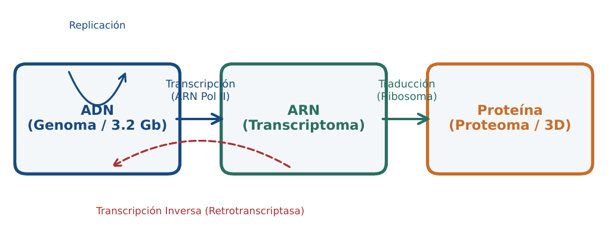
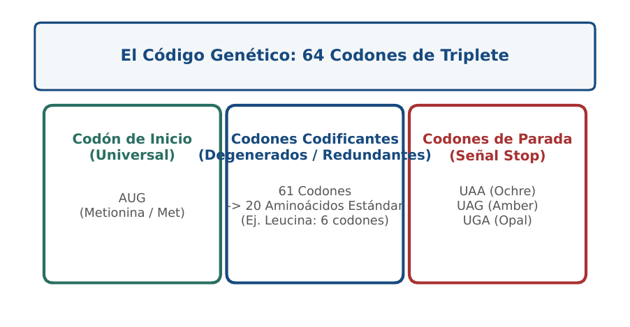
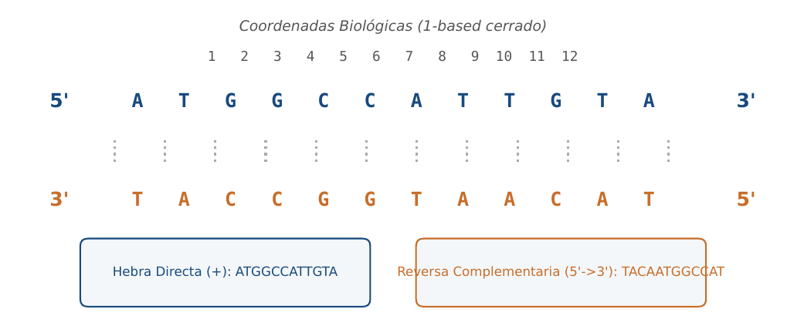

# BC01 · Dogma Central y Representación Digital

<div class="admonition note">
<p class="admonition-title">Bloque I: Fundamentos Biológicos y Biofísicos</p>
<p>Flujo de información ADN -> ARN -> Proteína, código genético degenerado de 64 codones, coordenadas biológicas 1-based y hebra reversa complementaria.</p>
</div>

!!! warning "Entrega Oficial en Campus Virtual"
    **Importante:** La entrega, evaluación y calificación oficial de esta práctica se realiza **exclusivamente a través del Campus Virtual**. Los kits descargables aquí son para experimentación y autoevaluación local (`check_practice_delivery.sh`).

---

=== "📖 Capítulo Teórico & Pseudocódigo"

    !!! info "📖 Material de Estudio Teórico (v4.0 · edición 2)"
        Puede consultar y descargar el capítulo individual en formato PDF para preparar esta sesión:

        [📥 Descargar Capítulo BC01 (PDF · v4.0)](../assets/capitulos/BC01_capitulo_v4.0.pdf){ .md-button .md-button--primary }


        [📚 Descargar el libro completo (PDF · v4.0)](../assets/libros/BC-libro_v4.0.pdf){ .md-button }

    ### Algoritmo Estructurado y Especificación Formal

    ```text
ALGORITMO: Reverse_Complement_1Based
ENTRADA: Secuencia ADN S de longitud L, Coordenadas (inicio, fin) en base 1
SALIDA: Subcadena reversa complementaria S_rc

1. Sub <- Subcadena(S, inicio, fin)
2. Tabla_Comp <- {'A':'T', 'T':'A', 'C':'G', 'G':'C'}
3. S_rc <- Invertir([Tabla_Comp[nt] para cada nt en Sub])
4. Retornar S_rc
    ```

    ???+ info "Complejidad Asintótica Formal"
        **Análisis:** O(L) tiempo lineal, O(L) memoria auxiliar para la cadena complementaria.

=== "📊 Diagramas Vectoriales"

    ### Diagrama Conceptual de Referencia (Figura 1)

    

    *Dogma Central: Transcripción de ADN a ARN mensajero y traducción mediante el código genético degenerado.*

    ---

    ### Esquemas Complementarios del Capítulo

    <div class="grid cards" markdown>
    - 
    - 
    </div>

=== "💻 Laboratorio & Descarga de Kit"

    ### Práctica 1: Dogma Central y Coordenadas Biológicas

    Manipulación de secuencias de ADN/ARN, cálculo de masa molecular teórica (110 Da/aa, 330 Da/nt), transcripción y traducción in silico.

    [📥 Descargar Kit de Práctica (kit_BC01.tar.gz)](../assets/kits/kit_BC01.tar.gz){ .md-button .md-button--primary }

    #### 1. Inicialización del Espacio de Trabajo
    ```bash
    tar -xzf kit_BC01.tar.gz
    bash create_workspace.sh MiEntrega_BC01
    cd MiEntrega_BC01
    ```

    #### 2. Autoevaluación Local (DELIVERY_OK)
    ```bash
    bash check_practice_delivery.sh MiEntrega_BC01
    # Debe emitir: [DELIVERY_OK] Practica BC01 verificada con exito (3.0 / 3.0 pts)
    ```

    #### 3. Empaquetado y Entrega en Campus Virtual
    Comprima su carpeta de entrega conteniendo sus scripts y súbala al Campus Virtual:
    ```bash
    tar -czf MiEntrega_BC01.tar.gz MiEntrega_BC01/
    ```

=== "⚡ Recursos Interactivos"

    ### Espacio de Experimentación y Modelado Computacional

    <div class="admonition tip">
    <p class="admonition-title">Entorno Interactivo y Datos Reproducibles</p>
    <p>Este módulo cuenta con implementaciones deterministas en Python 3.9 estándar (<code>SEED=42</code>) y oráculos formales incluidos en el kit de práctica.</p>
    </div>

=== "📋 Rúbrica ADR-001 (30/70)"

    ### Criterios Estandarizados de Evaluación

    | Componente | Peso | Criterio de Evaluación |
    | :--- | :---: | :--- |
    | **Entrega Técnica Automatizada** | **30% (3.0 pts)** | Ejecución correcta de practice_checks.py (1.0), cálculo exacto de coordenadas 1-based (1.0) y tipado estricto (1.0). |
    | **Razonamiento Bioinformático & Robustez** | **70% (7.0 pts)** | Explicación del impacto biológico de la degeneración del código (30%), gestión defensiva de bases ambiguas IUPAC (20%) e interpretación de marcos abiertos de lectura (20%). |

    !!! note "Marco de IA Responsable"
        - **Permitido con declaración:** Lluvia de ideas, depuración de sintaxis y consultas conceptuales.
        - **Restringido:** Generación directa de soluciones de entrega sin comprensión o verificación formal.
        - **No permitido:** Invención de referencias bibliográficas, alteración de datos experimentales o entrega no comprendida.

---

[Volver al Índice de Biología Computacional](index.md){ .md-button }
