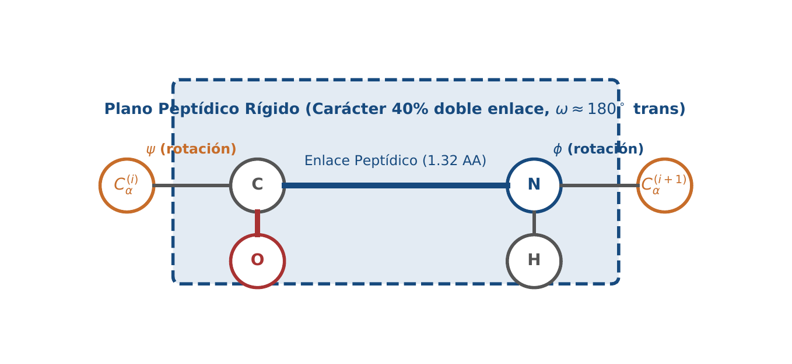
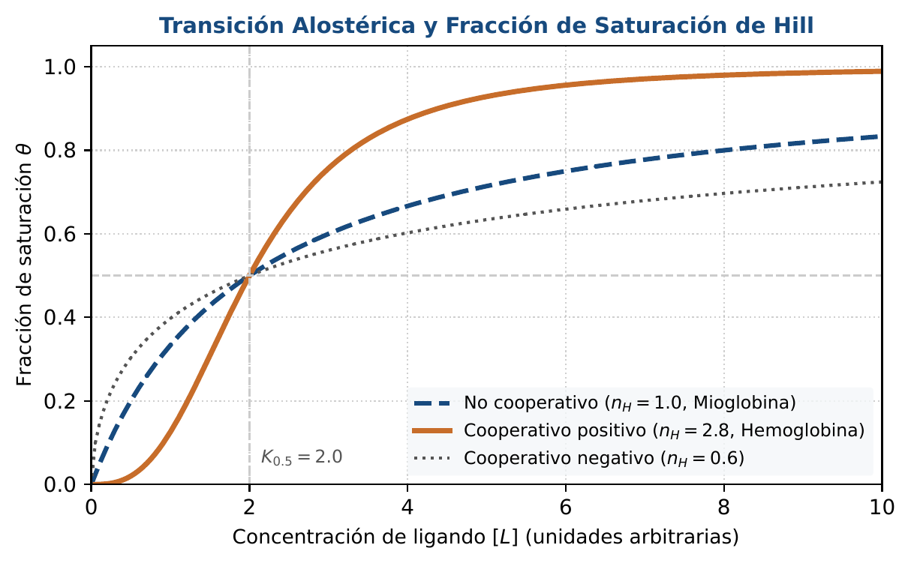
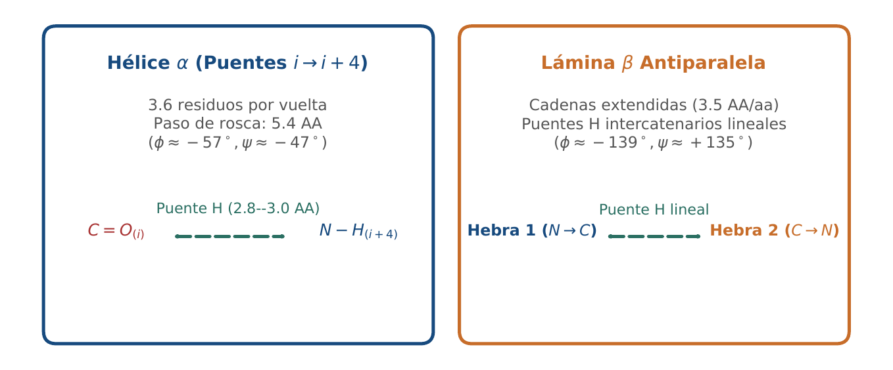

# BC02 · Biofísica de Proteínas y Estructura Secundaria

<div class="admonition note">
<p class="admonition-title">Bloque I: Fundamentos Biológicos y Biofísicos</p>
<p>Geometría planar del enlace peptídico, ángulos diedros (phi, psi), cooperatividad alostérica de Hill y patrones de puentes de hidrógeno en hélices alfa y láminas beta.</p>
</div>

!!! warning "Entrega Oficial en Campus Virtual"
    **Importante:** La entrega, evaluación y calificación oficial de esta práctica se realiza **exclusivamente a través del Campus Virtual**. Los kits descargables aquí son para experimentación y autoevaluación local (`check_practice_delivery.sh`).

---

=== "📖 Capítulo Teórico & Pseudocódigo"

    !!! info "📖 Material de Estudio Teórico (Versión 3.0)"
        Puede consultar y descargar el capítulo individual en formato PDF para preparar esta sesión:

        [📥 Descargar Capítulo BC02 (PDF · v3.0)](../assets/capitulos/BC02_capitulo_v3.0.pdf){ .md-button .md-button--primary }

    ### Algoritmo Estructurado y Especificación Formal

    ```text
ALGORITMO: Hill_Allosteric_Binding
ENTRADA: Concentracion ligando [L], Constante disociacion Kd, Coeficiente Hill n_H
SALIDA: Fraccion de saturacion Theta

1. Si [L] < 0 o Kd <= 0 o n_H <= 0: Lanzar ValueError
2. Numerador <- [L] ^ n_H
3. Denominador <- (Kd ^ n_H) + ([L] ^ n_H)
4. Retornar Numerador / Denominador
    ```

    ???+ info "Complejidad Asintótica Formal"
        **Análisis:** O(1) tiempo constante por evaluación de saturación ligando-receptor.

=== "📊 Diagramas Vectoriales"

    ### Diagrama Conceptual de Referencia (Figura 1)

    

    *Geometría del enlace peptídico: carácter parcial de doble enlace y rotaciones diedras permitidas.*

    ---

    ### Esquemas Complementarios del Capítulo

    <div class="grid cards" markdown>
    - 
    - 
    </div>

=== "💻 Laboratorio & Descarga de Kit"

    ### Práctica 2: Propiedades Fisicoquímicas y Alosterismo

    Cálculo de punto isoeléctrico pI, masa monoisotópica vs promedio, y curvas de saturación cooperativa de Hill.

    [📥 Descargar Kit de Práctica (kit_BC02.tar.gz)](../assets/kits/kit_BC02.tar.gz){ .md-button .md-button--primary }

    #### 1. Inicialización del Espacio de Trabajo
    ```bash
    tar -xzf kit_BC02.tar.gz
    bash create_workspace.sh MiEntrega_BC02
    cd MiEntrega_BC02
    ```

    #### 2. Autoevaluación Local (DELIVERY_OK)
    ```bash
    bash check_practice_delivery.sh MiEntrega_BC02
    # Debe emitir: [DELIVERY_OK] Practica BC02 verificada con exito (3.0 / 3.0 pts)
    ```

    #### 3. Empaquetado y Entrega en Campus Virtual
    Comprima su carpeta de entrega conteniendo sus scripts y súbala al Campus Virtual:
    ```bash
    tar -czf MiEntrega_BC02.tar.gz MiEntrega_BC02/
    ```

=== "⚡ Recursos Interactivos"

    ### Espacio de Experimentación y Modelado Computacional

    <div class="admonition tip">
    <p class="admonition-title">Entorno Interactivo y Datos Reproducibles</p>
    <p>Este módulo cuenta con implementaciones deterministas en Python 3.9 estándar (<code>SEED=42</code>) y oráculos formales incluidos en el kit de práctica.</p>
    </div>

=== "📋 Rúbrica ADR-001 (30/70)"

    ### Criterios Estandarizados de Evaluación

    | Componente | Peso | Criterio de Evaluación |
    | :--- | :---: | :--- |
    | **Entrega Técnica Automatizada** | **30% (3.0 pts)** | Superación de practice_checks.py (1.0), cálculo de pI con 0 errores (1.0) y modularidad (1.0). |
    | **Razonamiento Bioinformático & Robustez** | **70% (7.0 pts)** | Deducción de cooperatividad alostérica positiva n_H > 1 (30%), derivación de puentes H en hélices 3.6 residuos/giro (20%) y robustez numérica (20%). |

    !!! note "Marco de IA Responsable"
        - **Permitido con declaración:** Lluvia de ideas, depuración de sintaxis y consultas conceptuales.
        - **Restringido:** Generación directa de soluciones de entrega sin comprensión o verificación formal.
        - **No permitido:** Invención de referencias bibliográficas, alteración de datos experimentales o entrega no comprendida.

---

[Volver al Índice de Biología Computacional](index.md){ .md-button }
