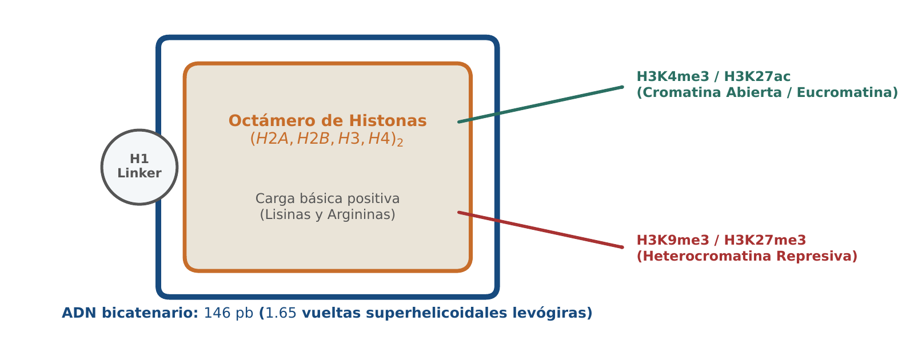
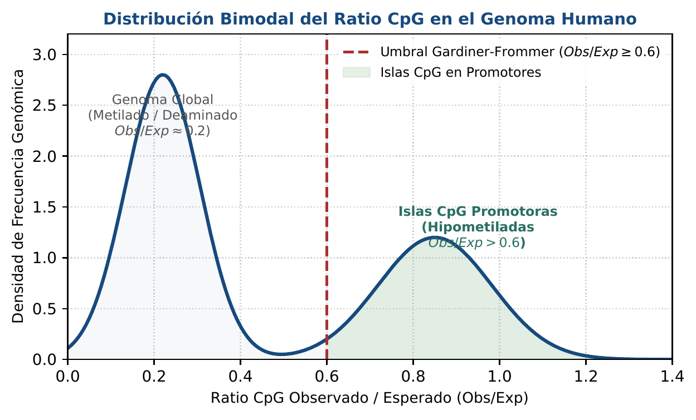
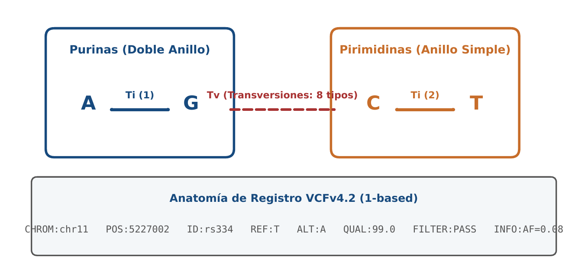

# BC03 · Arquitectura del Genoma y Variación de Secuencia

<div class="admonition note">
<p class="admonition-title">Bloque I: Fundamentos Biológicos y Biofísicos</p>
<p>Organización del genoma eucariota, nucleosomas (146 pb), islas CpG (ratio Obs/Esp > 0.6), transiciones/transversiones (Ti/Tv 2.0-2.1) y formato VCFv4.2.</p>
</div>

!!! warning "Entrega Oficial en Campus Virtual"
    **Importante:** La entrega, evaluación y calificación oficial de esta práctica se realiza **exclusivamente a través del Campus Virtual**. Los kits descargables aquí son para experimentación y autoevaluación local (`check_practice_delivery.sh`).

---

=== "📖 Capítulo Teórico & Pseudocódigo"

    !!! info "📖 Material de Estudio Teórico (Versión 3.0)"
        Puede consultar y descargar el capítulo individual en formato PDF para preparar esta sesión:

        [📥 Descargar Capítulo BC03 (PDF · v3.0)](../assets/capitulos/BC03_capitulo_v3.0.pdf){ .md-button .md-button--primary }

    ### Algoritmo Estructurado y Especificación Formal

    ```text
ALGORITMO: Calculo_CpG_ObsExp_Ratio
ENTRADA: Secuencia ADN S de longitud L
SALIDA: Ratio Obs/Esp, Porcentaje GC

1. N_CpG <- Contar_Dinucleotido(S, 'CG')
2. N_C <- Contar_Base(S, 'C'); N_G <- Contar_Base(S, 'G')
3. Ratio <- (N_CpG * L) / (N_C * N_G)
4. Pct_GC <- ((N_C + N_G) / L) * 100
5. Retornar (Ratio, Pct_GC)
    ```

    ???+ info "Complejidad Asintótica Formal"
        **Análisis:** O(L) tiempo lineal en un solo pase sobre la secuencia.

=== "📊 Diagramas Vectoriales"

    ### Diagrama Conceptual de Referencia (Figura 1)

    

    *El nucleosoma: 146 pb de ADN enrolladas en 1.65 vueltas sobre el octámero de histonas H2A, H2B, H3 y H4.*

    ---

    ### Esquemas Complementarios del Capítulo

    <div class="grid cards" markdown>
    - 
    - 
    </div>

=== "💻 Laboratorio & Descarga de Kit"

    ### Práctica 3: Análisis de Islas CpG y Anotación VCF

    Detección algorítmica de islas CpG promotoras, ratio Ti/Tv y parsing de registros VCFv4.2 de anemia falciforme (rs334).

    [📥 Descargar Kit de Práctica (kit_BC03.tar.gz)](../assets/kits/kit_BC03.tar.gz){ .md-button .md-button--primary }

    #### 1. Inicialización del Espacio de Trabajo
    ```bash
    tar -xzf kit_BC03.tar.gz
    bash create_workspace.sh MiEntrega_BC03
    cd MiEntrega_BC03
    ```

    #### 2. Autoevaluación Local (DELIVERY_OK)
    ```bash
    bash check_practice_delivery.sh MiEntrega_BC03
    # Debe emitir: [DELIVERY_OK] Practica BC03 verificada con exito (3.0 / 3.0 pts)
    ```

    #### 3. Empaquetado y Entrega en Campus Virtual
    Comprima su carpeta de entrega conteniendo sus scripts y súbala al Campus Virtual:
    ```bash
    tar -czf MiEntrega_BC03.tar.gz MiEntrega_BC03/
    ```

=== "⚡ Recursos Interactivos"

    ### Espacio de Experimentación y Modelado Computacional

    <div class="admonition tip">
    <p class="admonition-title">Entorno Interactivo y Datos Reproducibles</p>
    <p>Este módulo cuenta con implementaciones deterministas en Python 3.9 estándar (<code>SEED=42</code>) y oráculos formales incluidos en el kit de práctica.</p>
    </div>

=== "📋 Rúbrica ADR-001 (30/70)"

    ### Criterios Estandarizados de Evaluación

    | Componente | Peso | Criterio de Evaluación |
    | :--- | :---: | :--- |
    | **Entrega Técnica Automatizada** | **30% (3.0 pts)** | Parsing correcto de VCFv4.2 (1.0), cálculo exacto de islas CpG (1.0) y verificación automatizada (1.0). |
    | **Razonamiento Bioinformático & Robustez** | **70% (7.0 pts)** | Interpretación biológica del sesgo de desaminación de 5-metilcitosina (30%), diagnóstico de ratio Ti/Tv para control de calidad genómico (20%) y análisis de impacto funcional (20%). |

    !!! note "Marco de IA Responsable"
        - **Permitido con declaración:** Lluvia de ideas, depuración de sintaxis y consultas conceptuales.
        - **Restringido:** Generación directa de soluciones de entrega sin comprensión o verificación formal.
        - **No permitido:** Invención de referencias bibliográficas, alteración de datos experimentales o entrega no comprendida.

---

[Volver al Índice de Biología Computacional](index.md){ .md-button }
