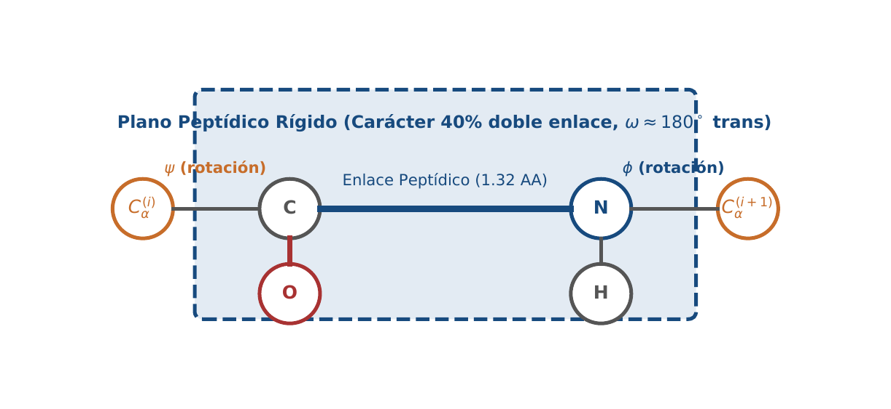
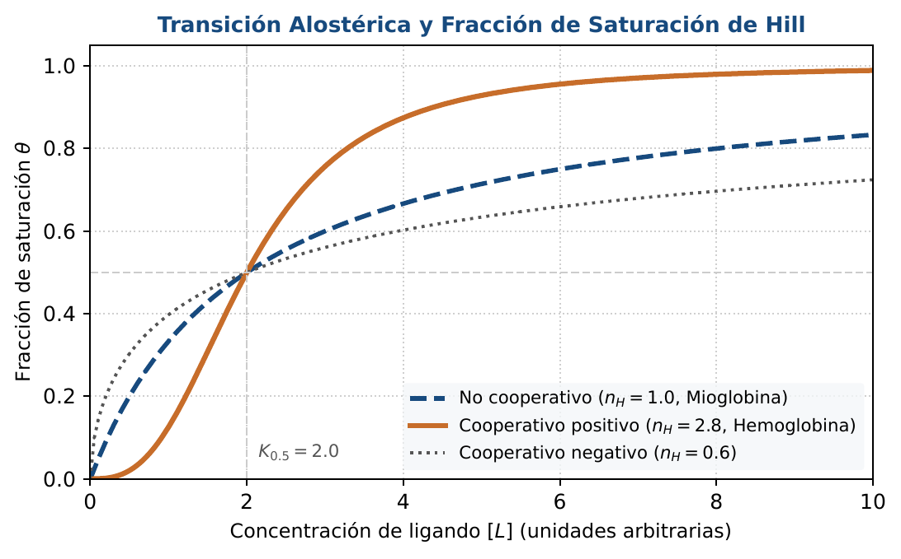
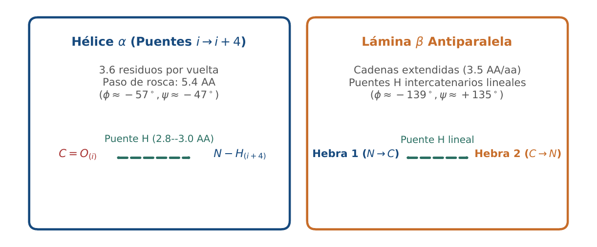

# BC04 · Transcripción, Splicing y Expresión Génica

<div class="admonition note">
<p class="admonition-title">Bloque I: Fundamentos Biológicos y Biofísicos</p>
<p>Ciclo de la ARN Polimerasa II, complejo PIC/CTD, splicing por transesterificación, hipótesis del bamboleo y normalización TPM invariante a 10^6.</p>
</div>

!!! warning "Entrega Oficial en Campus Virtual"
    **Importante:** La entrega, evaluación y calificación oficial de esta práctica se realiza **exclusivamente a través del Campus Virtual**. Los kits descargables aquí son para experimentación y autoevaluación local (`check_practice_delivery.sh`).

---

=== "📖 Capítulo Teórico & Pseudocódigo"

    !!! info "📖 Material de Estudio Teórico (v4.0 · edición 2)"
        Puede consultar y descargar el capítulo individual en formato PDF para preparar esta sesión:

        [📥 Descargar Capítulo BC04 (PDF · v4.0)](../assets/capitulos/BC04_capitulo_v4.0.pdf){ .md-button .md-button--primary }


        [📚 Descargar el libro completo (PDF · v4.0)](../assets/libros/BC-libro_v4.0.pdf){ .md-button }

    ### Algoritmo Estructurado y Especificación Formal

    ```text
ALGORITMO: Normalizacion_TPM_RNASeq
ENTRADA: Vector Counts C, Vector Longitudes L en kb
SALIDA: Vector Expresion TPM

1. RPK <- [C[i] / L[i] para cada gen i]
2. Suma_RPK <- Sumatorio(RPK)
3. Factor_Escala <- Suma_RPK / 10^6
4. TPM <- [RPK[i] / Factor_Escala para cada gen i]
5. Retornar TPM
    ```

    ???+ info "Complejidad Asintótica Formal"
        **Análisis:** O(G) donde G es el número total de genes evaluados.

=== "📊 Diagramas Vectoriales"

    ### Diagrama Conceptual de Referencia (Figura 1)

    

    *Transcripción eucariota: ensamblaje del PIC, fosforilación del CTD y elongación procesiva.*

    ---

    ### Esquemas Complementarios del Capítulo

    <div class="grid cards" markdown>
    - 
    - 
    </div>

=== "💻 Laboratorio & Descarga de Kit"

    ### Práctica 4: Splicing y Cuantificación TPM

    Simulación de transesterificaciones de splicing, cuantificación de expresión en TPM y verificación de la invariancia de suma a un millón.

    [📥 Descargar Kit de Práctica (kit_BC04.tar.gz)](../assets/kits/kit_BC04.tar.gz){ .md-button .md-button--primary }

    #### 1. Inicialización del Espacio de Trabajo
    ```bash
    tar -xzf kit_BC04.tar.gz
    bash create_workspace.sh MiEntrega_BC04
    cd MiEntrega_BC04
    ```

    #### 2. Autoevaluación Local (DELIVERY_OK)
    ```bash
    bash check_practice_delivery.sh MiEntrega_BC04
    # Debe emitir: [DELIVERY_OK] Practica BC04 verificada con exito (3.0 / 3.0 pts)
    ```

    #### 3. Empaquetado y Entrega en Campus Virtual
    Comprima su carpeta de entrega conteniendo sus scripts y súbala al Campus Virtual:
    ```bash
    tar -czf MiEntrega_BC04.tar.gz MiEntrega_BC04/
    ```

=== "⚡ Recursos Interactivos"

    ### Espacio de Experimentación y Modelado Computacional

    <div class="admonition tip">
    <p class="admonition-title">Entorno Interactivo y Datos Reproducibles</p>
    <p>Este módulo cuenta con implementaciones deterministas en Python 3.9 estándar (<code>SEED=42</code>) y oráculos formales incluidos en el kit de práctica.</p>
    </div>

=== "📋 Rúbrica ADR-001 (30/70)"

    ### Criterios Estandarizados de Evaluación

    | Componente | Peso | Criterio de Evaluación |
    | :--- | :---: | :--- |
    | **Entrega Técnica Automatizada** | **30% (3.0 pts)** | Invariancia estricta de suma sum(TPM)=10^6 (1.0), cálculo de RPK sin sesgo (1.0) y autocontrol (1.0). |
    | **Razonamiento Bioinformático & Robustez** | **70% (7.0 pts)** | Demostración de por qué TPM supera a RPKM/FPKM en comparativas inter-muestra (30%), análisis del balance GC3 y estabilidad del ARNm (20%) y defensa razonada (20%). |

    !!! note "Marco de IA Responsable"
        - **Permitido con declaración:** Lluvia de ideas, depuración de sintaxis y consultas conceptuales.
        - **Restringido:** Generación directa de soluciones de entrega sin comprensión o verificación formal.
        - **No permitido:** Invención de referencias bibliográficas, alteración de datos experimentales o entrega no comprendida.

---

[Volver al Índice de Biología Computacional](index.md){ .md-button }
