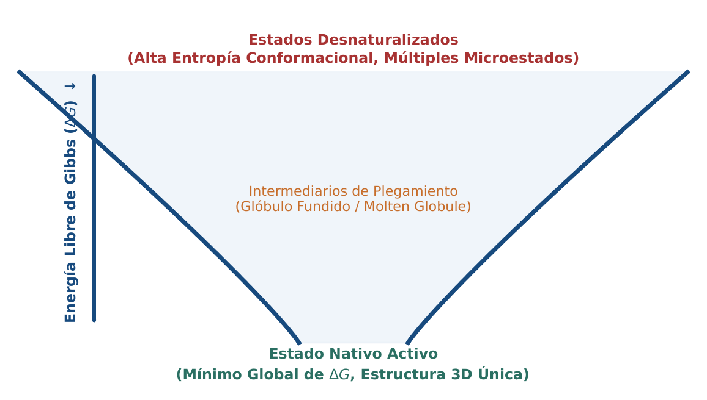
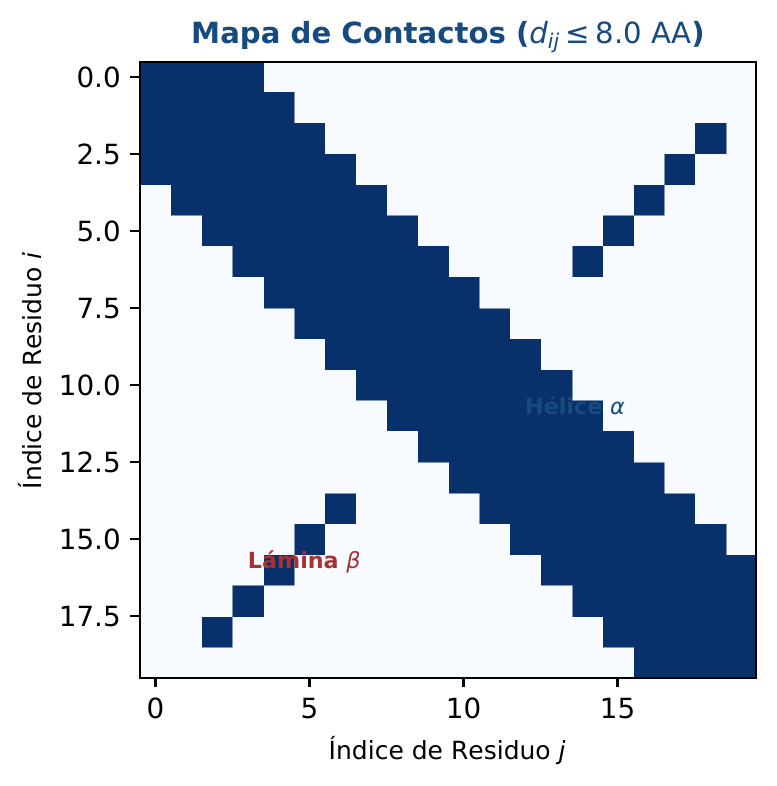
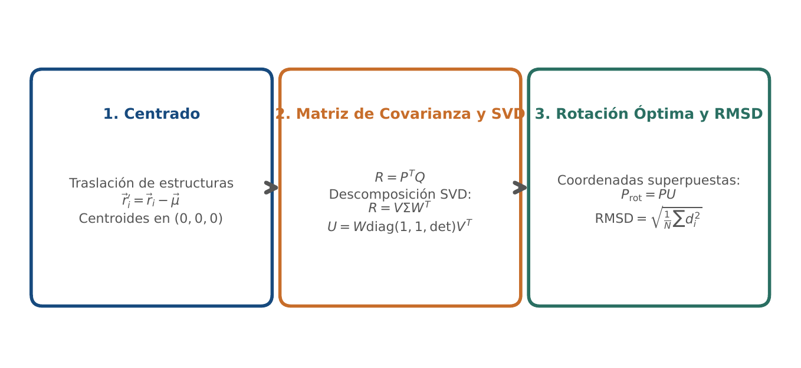

# BC05 · Plegamiento y Geometría Macromolecular

<div class="admonition note">
<p class="admonition-title">Bloque I: Fundamentos Biológicos y Biofísicos</p>
<p>Hipótesis de Anfinsen, embudo de plegamiento, formato PDB, distancias 3D, mapas de contacto inter-Ca (8.0 A) y superposición de Kabsch por SVD.</p>
</div>

!!! warning "Entrega Oficial en Campus Virtual"
    **Importante:** La entrega, evaluación y calificación oficial de esta práctica se realiza **exclusivamente a través del Campus Virtual**. Los kits descargables aquí son para experimentación y autoevaluación local (`check_practice_delivery.sh`).

---

=== "📖 Capítulo Teórico & Pseudocódigo"

    !!! info "📖 Material de Estudio Teórico (Versión 3.0)"
        Puede consultar y descargar el capítulo individual en formato PDF para preparar esta sesión:

        [📥 Descargar Capítulo BC05 (PDF · v3.0)](../assets/capitulos/BC05_capitulo_v3.0.pdf){ .md-button .md-button--primary }

    ### Algoritmo Estructurado y Especificación Formal

    ```text
ALGORITMO: Superposicion_Kabsch_RMSD
ENTRADA: Coordenadas P (diana), Coordenadas Q (modelo) de N atomos centrados
SALIDA: Matriz de Rotacion U, RMSD optimo

1. Matriz_Covarianza H <- Transpuesta(P) * Q
2. V, S, Wt <- Descomposicion_Valores_Singulares(H)
3. d <- Determinante(V * Wt)
4. Matriz_D <- Diagonal(1, 1, d)
5. Matriz_Rotacion U <- V * Matriz_D * Wt
6. Q_rot <- Q * Transpuesta(U)
7. RMSD <- sqrt(Sumatorio(||P_i - Q_rot_i||^2) / N)
8. Retornar (U, RMSD)
    ```

    ???+ info "Complejidad Asintótica Formal"
        **Análisis:** O(N) para calcular la covarianza más O(3^3) = O(1) para el SVD 3x3.

=== "📊 Diagramas Vectoriales"

    ### Diagrama Conceptual de Referencia (Figura 1)

    

    *Embudo de Anfinsen: descenso por gradiente de energía libre desde estados desnaturalizados hasta la conformación nativa mínima.*

    ---

    ### Esquemas Complementarios del Capítulo

    <div class="grid cards" markdown>
    - 
    - 
    </div>

=== "💻 Laboratorio & Descarga de Kit"

    ### Práctica 5: Geometría PDB y Algoritmo de Kabsch

    Extracción de coordenadas PDB de ancho fijo, cálculo de mapas de contacto Ca-Ca y superposición estructural óptima de Kabsch.

    [📥 Descargar Kit de Práctica (kit_BC05.tar.gz)](../assets/kits/kit_BC05.tar.gz){ .md-button .md-button--primary }

    #### 1. Inicialización del Espacio de Trabajo
    ```bash
    tar -xzf kit_BC05.tar.gz
    bash create_workspace.sh MiEntrega_BC05
    cd MiEntrega_BC05
    ```

    #### 2. Autoevaluación Local (DELIVERY_OK)
    ```bash
    bash check_practice_delivery.sh MiEntrega_BC05
    # Debe emitir: [DELIVERY_OK] Practica BC05 verificada con exito (3.0 / 3.0 pts)
    ```

    #### 3. Empaquetado y Entrega en Campus Virtual
    Comprima su carpeta de entrega conteniendo sus scripts y súbala al Campus Virtual:
    ```bash
    tar -czf MiEntrega_BC05.tar.gz MiEntrega_BC05/
    ```

=== "⚡ Recursos Interactivos"

    ### Espacio de Experimentación y Modelado Computacional

    <div class="admonition tip">
    <p class="admonition-title">Entorno Interactivo y Datos Reproducibles</p>
    <p>Este módulo cuenta con implementaciones deterministas en Python 3.9 estándar (<code>SEED=42</code>) y oráculos formales incluidos en el kit de práctica.</p>
    </div>

=== "📋 Rúbrica ADR-001 (30/70)"

    ### Criterios Estandarizados de Evaluación

    | Componente | Peso | Criterio de Evaluación |
    | :--- | :---: | :--- |
    | **Entrega Técnica Automatizada** | **30% (3.0 pts)** | Cálculo de RMSD con precisión de 6 decimales (1.0), mapa de contacto binario a 8.0 A (1.0) y pruebas de dominio (1.0). |
    | **Razonamiento Bioinformático & Robustez** | **70% (7.0 pts)** | Deducción matemática de la corrección del determinante en Kabsch para evitar reflexiones espaciales (30%), análisis del paisaje termodinámico (20%) e invariancia traslacional (20%). |

    !!! note "Marco de IA Responsable"
        - **Permitido con declaración:** Lluvia de ideas, depuración de sintaxis y consultas conceptuales.
        - **Restringido:** Generación directa de soluciones de entrega sin comprensión o verificación formal.
        - **No permitido:** Invención de referencias bibliográficas, alteración de datos experimentales o entrega no comprendida.

---

[Volver al Índice de Biología Computacional](index.md){ .md-button }
