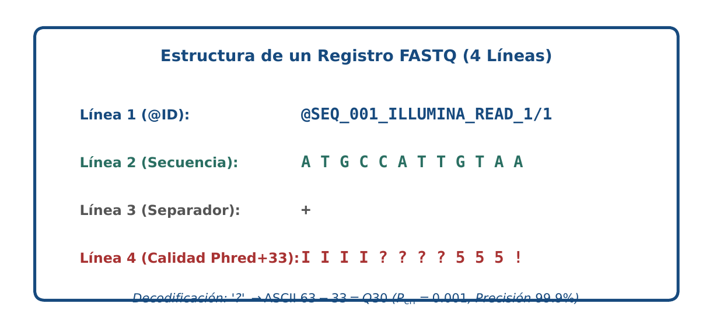
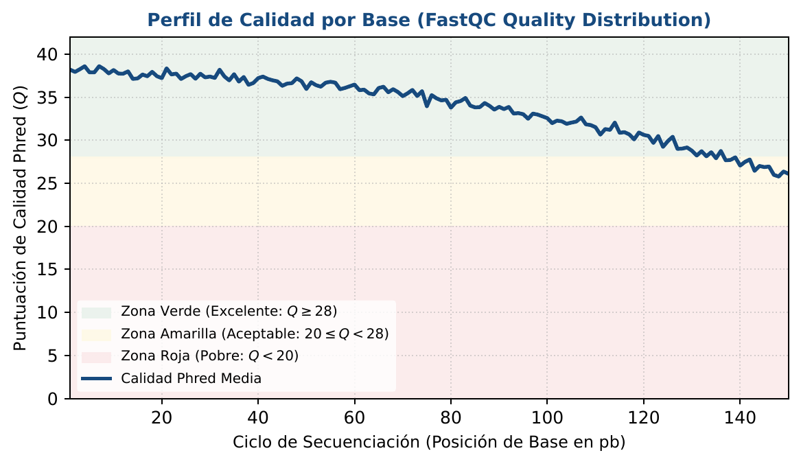
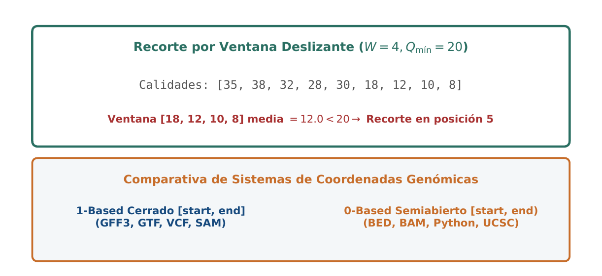

# BC07 · Formatos FASTQ y Control de Calidad

<div class="admonition note">
<p class="admonition-title">Bloque II: Algoritmos y Tecnologías Genómicas</p>
<p>Anatomía de registros FASTQ de 4 líneas, decodificación Phred+33, diagnóstico de módulos FastQC y algoritmo de recorte por ventana deslizante.</p>
</div>

!!! warning "Entrega Oficial en Campus Virtual"
    **Importante:** La entrega, evaluación y calificación oficial de esta práctica se realiza **exclusivamente a través del Campus Virtual**. Los kits descargables aquí son para experimentación y autoevaluación local (`check_practice_delivery.sh`).

---

=== "📖 Capítulo Teórico & Pseudocódigo"

    !!! info "📖 Material de Estudio Teórico (v4.0 · edición 2)"
        Puede consultar y descargar el capítulo individual en formato PDF para preparar esta sesión:

        [📥 Descargar Capítulo BC07 (PDF · v4.0)](../assets/capitulos/BC07_capitulo_v4.0.pdf){ .md-button .md-button--primary }


        [📚 Descargar el libro completo (PDF · v4.0)](../assets/libros/BC-libro_v4.0.pdf){ .md-button }

    ### Algoritmo Estructurado y Especificación Formal

    ```text
ALGORITMO: Recorte_Ventana_Deslizante_Calidad
ENTRADA: Vector Calidades Q, Tamano Ventana W, Umbral Calidad Q_min
SALIDA: Indice de corte optimo

1. Para i desde 0 hasta (Longitud(Q) - W):
     Media_Ventana <- Sumatorio(Q[i : i+W]) / W
     Si Media_Ventana < Q_min:
       Retornar i (Posicion de corte)
2. Retornar Longitud(Q) (Lectura completa valida)
    ```

    ???+ info "Complejidad Asintótica Formal"
        **Análisis:** O(N) tiempo lineal con ventana deslizante optimizada.

=== "📊 Diagramas Vectoriales"

    ### Diagrama Conceptual de Referencia (Figura 1)

    

    *Estructura FASTQ: Identificador, secuencia biológica, separador '+' y calidades codificadas en ASCII Phred+33.*

    ---

    ### Esquemas Complementarios del Capítulo

    <div class="grid cards" markdown>
    - 
    - 
    </div>

=== "💻 Laboratorio & Descarga de Kit"

    ### Práctica 7: Calidad Phred y Trimming de FASTQ

    Parser FASTQ de 4 líneas, conversión ASCII a Phred y recorte adaptativo por calidad y adaptadores.

    [📥 Descargar Kit de Práctica (kit_BC07.tar.gz)](../assets/kits/kit_BC07.tar.gz){ .md-button .md-button--primary }

    #### 1. Inicialización del Espacio de Trabajo
    ```bash
    tar -xzf kit_BC07.tar.gz
    bash create_workspace.sh MiEntrega_BC07
    cd MiEntrega_BC07
    ```

    #### 2. Autoevaluación Local (DELIVERY_OK)
    ```bash
    bash check_practice_delivery.sh MiEntrega_BC07
    # Debe emitir: [DELIVERY_OK] Practica BC07 verificada con exito (3.0 / 3.0 pts)
    ```

    #### 3. Empaquetado y Entrega en Campus Virtual
    Comprima su carpeta de entrega conteniendo sus scripts y súbala al Campus Virtual:
    ```bash
    tar -czf MiEntrega_BC07.tar.gz MiEntrega_BC07/
    ```

=== "⚡ Recursos Interactivos"

    ### Espacio de Experimentación y Modelado Computacional

    <div class="admonition tip">
    <p class="admonition-title">Entorno Interactivo y Datos Reproducibles</p>
    <p>Este módulo cuenta con implementaciones deterministas en Python 3.9 estándar (<code>SEED=42</code>) y oráculos formales incluidos en el kit de práctica.</p>
    </div>

=== "📋 Rúbrica ADR-001 (30/70)"

    ### Criterios Estandarizados de Evaluación

    | Componente | Peso | Criterio de Evaluación |
    | :--- | :---: | :--- |
    | **Entrega Técnica Automatizada** | **30% (3.0 pts)** | Conversión Phred+33 exacta (1.0), recorte por ventana deslizante funcional (1.0) y autocontrol (1.0). |
    | **Razonamiento Bioinformático & Robustez** | **70% (7.0 pts)** | Diferenciación entre coordenadas 1-based cerradas (VCF/GFF) y 0-based semiabiertas (BED/BAM) (30%), diagnóstico de contaminación por adaptadores (20%) y robustez (20%). |

    !!! note "Marco de IA Responsable"
        - **Permitido con declaración:** Lluvia de ideas, depuración de sintaxis y consultas conceptuales.
        - **Restringido:** Generación directa de soluciones de entrega sin comprensión o verificación formal.
        - **No permitido:** Invención de referencias bibliográficas, alteración de datos experimentales o entrega no comprendida.

---

[Volver al Índice de Biología Computacional](index.md){ .md-button }
