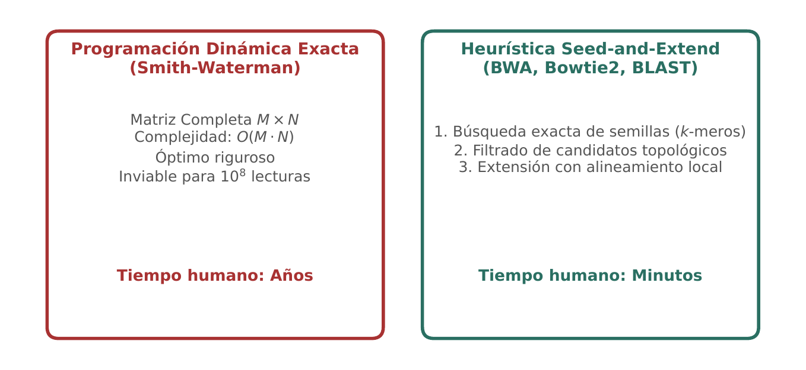
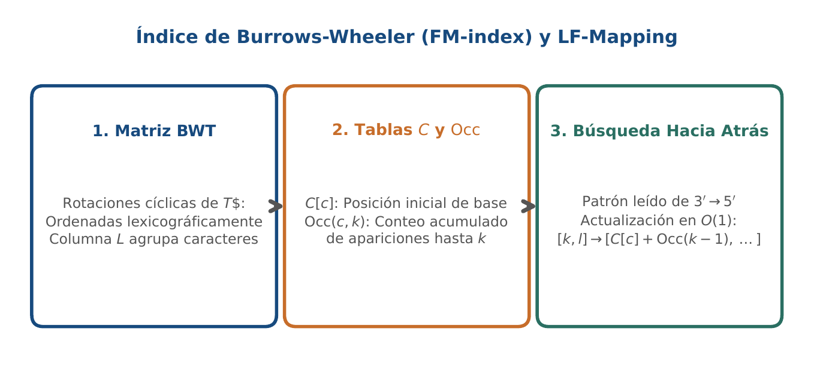
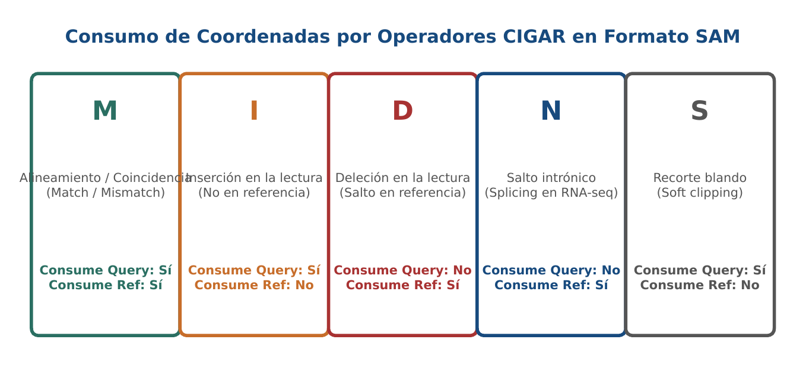

# BC08 · Alineamiento y Mapeo Genómico SAM/BAM

<div class="admonition note">
<p class="admonition-title">Bloque II: Algoritmos y Tecnologías Genómicas</p>
<p>Transformada de Burrows-Wheeler (BWT), FM-index en tiempo lineal O(L), formato SAM/BAM de 11 campos y operaciones de cadenas CIGAR (M, I, D, N, S).</p>
</div>

!!! warning "Entrega Oficial en Campus Virtual"
    **Importante:** La entrega, evaluación y calificación oficial de esta práctica se realiza **exclusivamente a través del Campus Virtual**. Los kits descargables aquí son para experimentación y autoevaluación local (`check_practice_delivery.sh`).

---

=== "📖 Capítulo Teórico & Pseudocódigo"

    !!! info "📖 Material de Estudio Teórico (Versión 3.0)"
        Puede consultar y descargar el capítulo individual en formato PDF para preparar esta sesión:

        [📥 Descargar Capítulo BC08 (PDF · v3.0)](../assets/capitulos/BC08_capitulo_v3.0.pdf){ .md-button .md-button--primary }

    ### Algoritmo Estructurado y Especificación Formal

    ```text
ALGORITMO: BWT_LF_Mapping_Exact_Match
ENTRADA: Cadena BWT L_col, Matriz Occ(c, k), Array C_count(c), Patron P
SALIDA: Rango de coincidencias exactas [sp, ep]

1. char <- P[Longitud(P) - 1]
2. sp <- C_count[char] + 1; ep <- C_count[char+1]
3. Para i desde (Longitud(P) - 2) bajando hasta 0:
     char <- P[i]
     sp <- C_count[char] + Occ(char, sp - 1) + 1
     ep <- C_count[char] + Occ(char, ep)
     Si sp > ep: Retornar (0, 0) (Sin coincidencias)
4. Retornar [sp, ep]
    ```

    ???+ info "Complejidad Asintótica Formal"
        **Análisis:** O(L) donde L es la longitud del patrón, independiente del tamaño del genoma.

=== "📊 Diagramas Vectoriales"

    ### Diagrama Conceptual de Referencia (Figura 1)

    

    *Heurística de indexación: BWT y FM-index para localización de semillas en O(L) seguido de extensión local.*

    ---

    ### Esquemas Complementarios del Capítulo

    <div class="grid cards" markdown>
    - 
    - 
    </div>

=== "💻 Laboratorio & Descarga de Kit"

    ### Práctica 8: BWT, FM-Index y Parsing de CIGAR

    Implementación de LF-mapping sobre BWT, decodificación de registros SAM y cálculo de longitud alineada en CIGAR.

    [📥 Descargar Kit de Práctica (kit_BC08.tar.gz)](../assets/kits/kit_BC08.tar.gz){ .md-button .md-button--primary }

    #### 1. Inicialización del Espacio de Trabajo
    ```bash
    tar -xzf kit_BC08.tar.gz
    bash create_workspace.sh MiEntrega_BC08
    cd MiEntrega_BC08
    ```

    #### 2. Autoevaluación Local (DELIVERY_OK)
    ```bash
    bash check_practice_delivery.sh MiEntrega_BC08
    # Debe emitir: [DELIVERY_OK] Practica BC08 verificada con exito (3.0 / 3.0 pts)
    ```

    #### 3. Empaquetado y Entrega en Campus Virtual
    Comprima su carpeta de entrega conteniendo sus scripts y súbala al Campus Virtual:
    ```bash
    tar -czf MiEntrega_BC08.tar.gz MiEntrega_BC08/
    ```

=== "⚡ Recursos Interactivos"

    ### Espacio de Experimentación y Modelado Computacional

    <div class="admonition tip">
    <p class="admonition-title">Entorno Interactivo y Datos Reproducibles</p>
    <p>Este módulo cuenta con implementaciones deterministas en Python 3.9 estándar (<code>SEED=42</code>) y oráculos formales incluidos en el kit de práctica.</p>
    </div>

=== "📋 Rúbrica ADR-001 (30/70)"

    ### Criterios Estandarizados de Evaluación

    | Componente | Peso | Criterio de Evaluación |
    | :--- | :---: | :--- |
    | **Entrega Técnica Automatizada** | **30% (3.0 pts)** | Búsqueda exacta con FM-index (1.0), parser SAM de 11 columnas (1.0) y tests de ejecución (1.0). |
    | **Razonamiento Bioinformático & Robustez** | **70% (7.0 pts)** | Distinción entre MAPQ=0 y lecturas únicas de alta confianza (30%), manejo de alineamientos con splicing (operador N) (20%) y justificación de marcado de duplicados (20%). |

    !!! note "Marco de IA Responsable"
        - **Permitido con declaración:** Lluvia de ideas, depuración de sintaxis y consultas conceptuales.
        - **Restringido:** Generación directa de soluciones de entrega sin comprensión o verificación formal.
        - **No permitido:** Invención de referencias bibliográficas, alteración de datos experimentales o entrega no comprendida.

---

[Volver al Índice de Biología Computacional](index.md){ .md-button }
