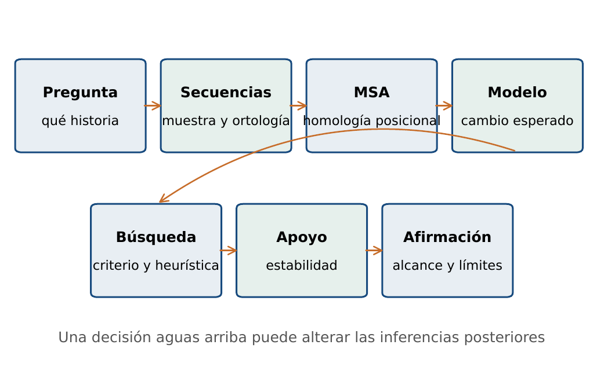
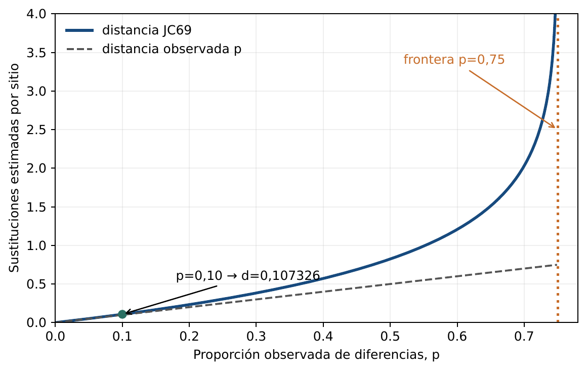
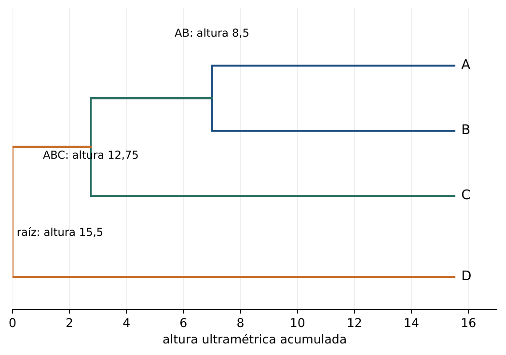
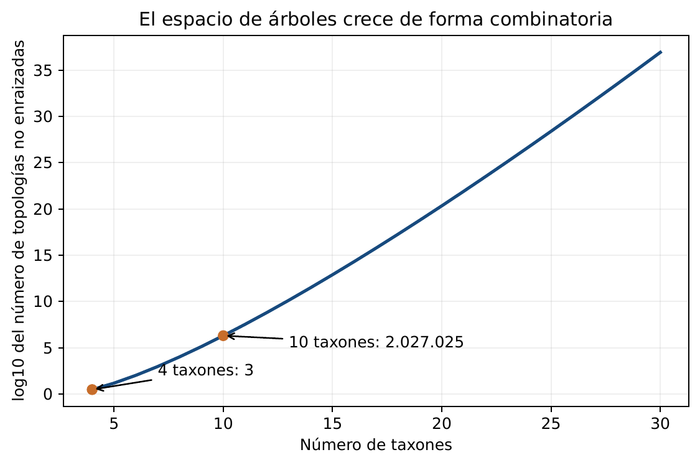
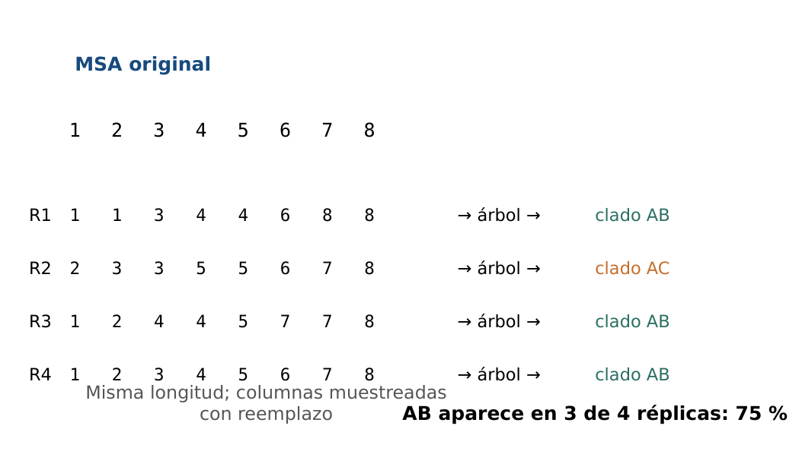
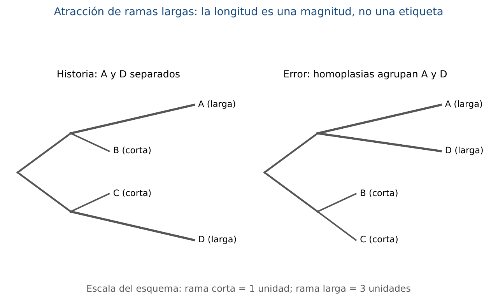
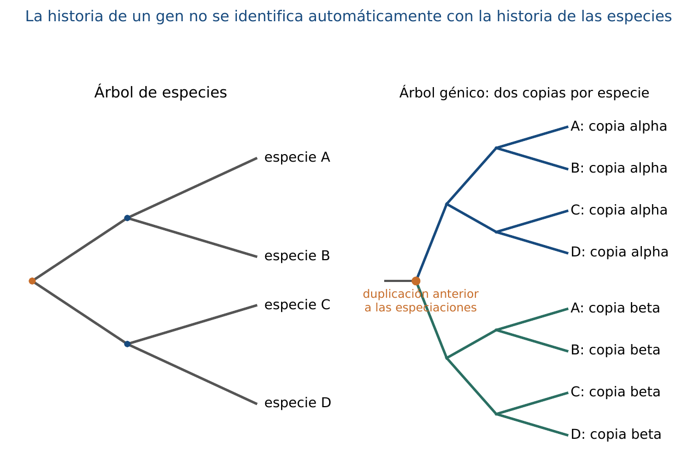

# BC09 · De secuencias homólogas a hipótesis evolutivas

<div class="admonition note">
<p class="admonition-title">Bloque III: Filogenia Molecular y Regulación Génica</p>
<p>Modelos de sustitución de nucleótidos (JC69, K2P), distancias corregidas, construcción de árboles (UPGMA, Neighbor-Joining) y soporte estadístico Bootstrap.</p>
</div>

---

=== "📖 Capítulo Teórico & Pseudocódigo"

    !!! info "📖 Material de Estudio Teórico (v4.0 · edición 2)"
        Puede consultar y descargar el capítulo individual en formato PDF para preparar esta sesión:

        [📥 Descargar Capítulo BC09 (PDF · v4.0)](../assets/capitulos/BC09_capitulo_v4.0.pdf){ .md-button .md-button--primary }


    ### Algoritmo Estructurado y Especificación Formal

    ```text
ALGORITMO: Jukes_Cantor_JC69_Distance
ENTRADA: Proporcion de diferencias observadas p
SALIDA: Distancia evolutiva corregida d

1. Si p < 0 o p >= 0.75: Lanzar ValueError (Saturacion mutacional)
2. d <- -0.75 * ln(1.0 - (4.0 / 3.0) * p)
3. Retornar d
    ```

    ???+ info "Complejidad Asintótica Formal"
        **Análisis:** O(1) cálculo analítico por par de secuencias.

=== "📊 Diagramas Vectoriales"

    ### Diagrama Conceptual de Referencia (Figura 1)

    

    *Inferencia filogenética: Corrección de distancias evolutivas y reconstrucción topológica por Neighbor-Joining.*

    ---

    ### Esquemas Complementarios del Capítulo

    <div class="grid cards" markdown>
    - 
    - 
    - 
    - 
    - 
    - 
    - 
    - 
    - 
    </div>


!!! note "Práctica retirada"
    El anexo práctico y sus archivos descargables están retirados temporalmente mientras se rediseñan las actividades. El capítulo teórico permanece disponible.

---

[Volver al Índice de Biología Computacional](index.md){ .md-button }
