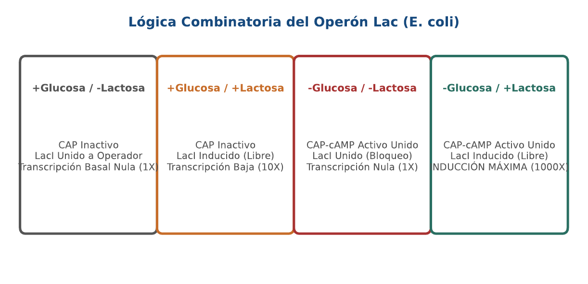
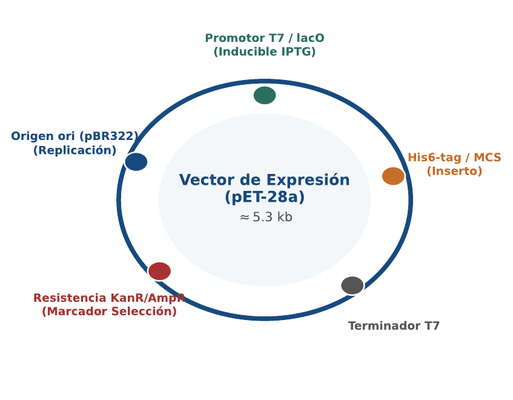
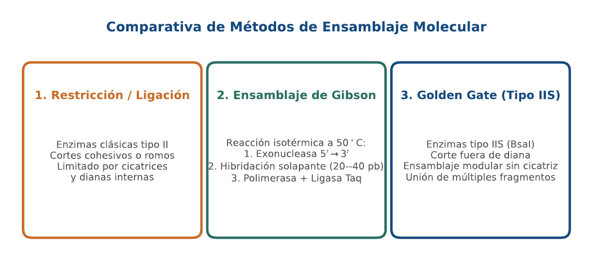

# BC10 · Regulación Génica, Clonación y Plásmidos

<div class="admonition note">
<p class="admonition-title">Bloque III: Filogenia Molecular y Regulación Génica</p>
<p>Lógica del operón Lac (LacI / CAP-cAMP), atenuación en Trp, anatomía del plásmido pET-28a, diseño de cebadores in silico y métodos de ensamblaje (Gibson / Golden Gate).</p>
</div>

!!! warning "Entrega Oficial en Campus Virtual"
    **Importante:** La entrega, evaluación y calificación oficial de esta práctica se realiza **exclusivamente a través del Campus Virtual**. Los kits descargables aquí son para experimentación y autoevaluación local (`check_practice_delivery.sh`).

---

=== "📖 Capítulo Teórico & Pseudocódigo"

    !!! info "📖 Material de Estudio Teórico (v4.0 · edición 2)"
        Puede consultar y descargar el capítulo individual en formato PDF para preparar esta sesión:

        [📥 Descargar Capítulo BC10 (PDF · v4.0)](../assets/capitulos/BC10_capitulo_v4.0.pdf){ .md-button .md-button--primary }


        [📚 Descargar el libro completo (PDF · v4.0)](../assets/libros/BC-libro_v4.0.pdf){ .md-button }

    ### Algoritmo Estructurado y Especificación Formal

    ```text
ALGORITMO: Calculo_Tm_Primer_SantaLucia
ENTRADA: Secuencia cebador S
SALIDA: Temperatura de fusion Tm en grados Celsius

1. L <- Longitud(S); GC_pct <- Porcentaje_GC(S)
2. Si L < 14:
     Tm <- (Contar(S, 'A') + Contar(S, 'T')) * 2 + (Contar(S, 'G') + Contar(S, 'C')) * 4
3. Sino:
     Tm <- 64.9 + 41.0 * (Contar(S, 'G') + Contar(S, 'C') - 16.4) / L
4. Retornar Tm
    ```

    ???+ info "Complejidad Asintótica Formal"
        **Análisis:** O(L) tiempo lineal respecto a la longitud del oligonucleótido.

=== "📊 Diagramas Vectoriales"

    ### Diagrama Conceptual de Referencia (Figura 1)

    

    *Regulación transcripcional: Activación por CAP-cAMP e inducción por alolactosa para la máxima expresión de beta-galactosidasa.*

    ---

    ### Esquemas Complementarios del Capítulo

    <div class="grid cards" markdown>
    - 
    - 
    </div>

=== "💻 Laboratorio & Descarga de Kit"

    ### Práctica 10: Diseño de Cebadores y Simulación de Enzimas

    Evaluación de la expresión del operón Lac, diseño de cebadores PCR con control de Tm y mapeo de sitios de restricción EcoRI.

    [📥 Descargar Kit de Práctica (kit_BC10.tar.gz)](../assets/kits/kit_BC10.tar.gz){ .md-button .md-button--primary }

    #### 1. Inicialización del Espacio de Trabajo
    ```bash
    tar -xzf kit_BC10.tar.gz
    bash create_workspace.sh MiEntrega_BC10
    cd MiEntrega_BC10
    ```

    #### 2. Autoevaluación Local (DELIVERY_OK)
    ```bash
    bash check_practice_delivery.sh MiEntrega_BC10
    # Debe emitir: [DELIVERY_OK] Practica BC10 verificada con exito (3.0 / 3.0 pts)
    ```

    #### 3. Empaquetado y Entrega en Campus Virtual
    Comprima su carpeta de entrega conteniendo sus scripts y súbala al Campus Virtual:
    ```bash
    tar -czf MiEntrega_BC10.tar.gz MiEntrega_BC10/
    ```

=== "⚡ Recursos Interactivos"

    ### Espacio de Experimentación y Modelado Computacional

    <div class="admonition tip">
    <p class="admonition-title">Entorno Interactivo y Datos Reproducibles</p>
    <p>Este módulo cuenta con implementaciones deterministas en Python 3.9 estándar (<code>SEED=42</code>) y oráculos formales incluidos en el kit de práctica.</p>
    </div>

=== "📋 Rúbrica ADR-001 (30/70)"

    ### Criterios Estandarizados de Evaluación

    | Componente | Peso | Criterio de Evaluación |
    | :--- | :---: | :--- |
    | **Entrega Técnica Automatizada** | **30% (3.0 pts)** | Diseño de primers con Tm correcta (1.0), detección de sitios de corte (1.0) y verificación (1.0). |
    | **Razonamiento Bioinformático & Robustez** | **70% (7.0 pts)** | Análisis de represión catabólica por glucosa (30%), prevención de dímeros de cebador y horquillas (20%) y comparación Gibson vs Golden Gate (20%). |

    !!! note "Marco de IA Responsable"
        - **Permitido con declaración:** Lluvia de ideas, depuración de sintaxis y consultas conceptuales.
        - **Restringido:** Generación directa de soluciones de entrega sin comprensión o verificación formal.
        - **No permitido:** Invención de referencias bibliográficas, alteración de datos experimentales o entrega no comprendida.

---

[Volver al Índice de Biología Computacional](index.md){ .md-button }
