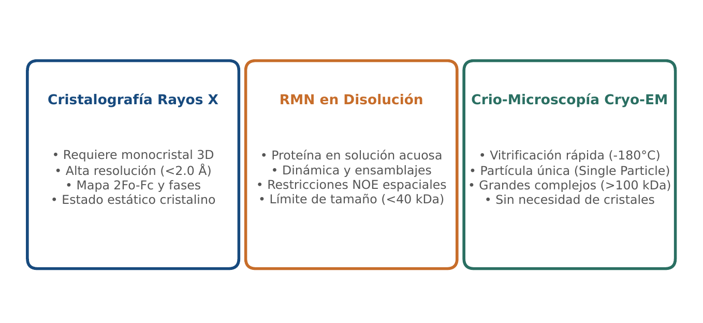
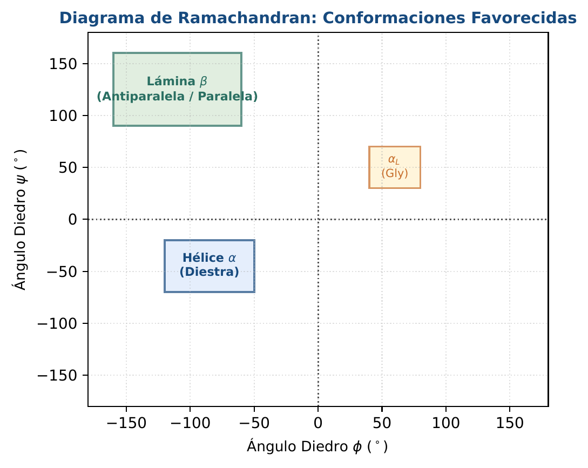
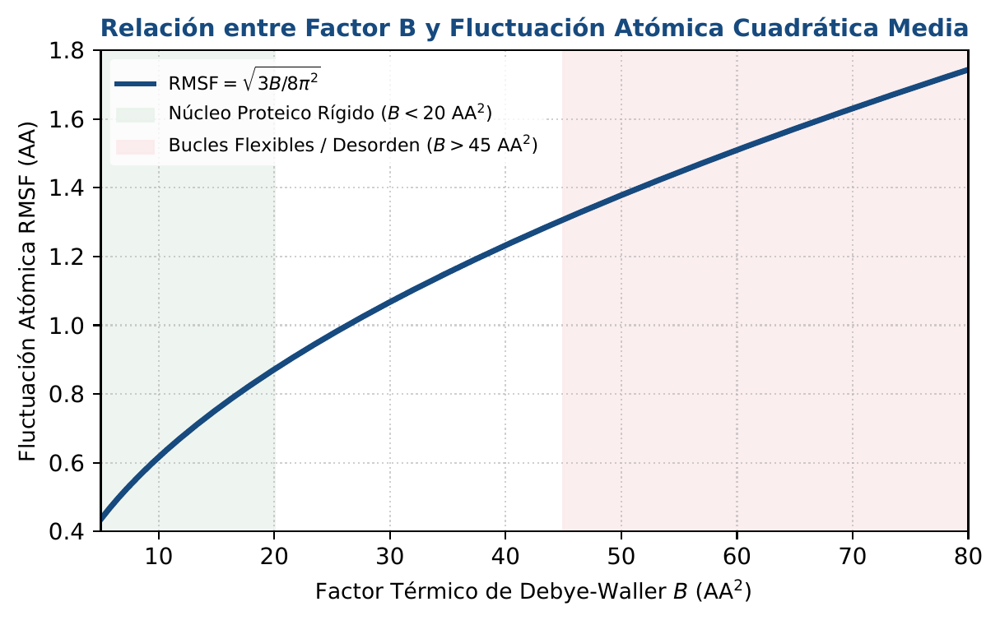

# BC11 · Estructura 3D de Proteínas y Validación

<div class="admonition note">
<p class="admonition-title">Bloque IV: Estructura, Dinámica y Biomedicina Computacional</p>
<p>Determinación experimental (Rayos X, RMN, Cryo-EM), formato PDB/mmCIF, factores B térmicos de Debye-Waller, diagrama de Ramachandran y clasificaciones CATH/SCOP.</p>
</div>

!!! warning "Entrega Oficial en Campus Virtual"
    **Importante:** La entrega, evaluación y calificación oficial de esta práctica se realiza **exclusivamente a través del Campus Virtual**. Los kits descargables aquí son para experimentación y autoevaluación local (`check_practice_delivery.sh`).

---

=== "📖 Capítulo Teórico & Pseudocódigo"

    !!! info "📖 Material de Estudio Teórico (Versión 3.0)"
        Puede consultar y descargar el capítulo individual en formato PDF para preparar esta sesión:

        [📥 Descargar Capítulo BC11 (PDF · v3.0)](../assets/capitulos/BC11_capitulo_v3.0.pdf){ .md-button .md-button--primary }

    ### Algoritmo Estructurado y Especificación Formal

    ```text
ALGORITMO: BFactor_to_RMSF_Fluctuation
ENTRADA: Factor termico de Debye-Waller B
SALIDA: Desplazamiento cuadratico medio RMSF en Angstroms

1. Si B < 0: Lanzar ValueError
2. U_cuadrado <- B / (8.0 * (pi ^ 2))
3. RMSF <- sqrt(U_cuadrado)
4. Retornar (U_cuadrado, RMSF)
    ```

    ???+ info "Complejidad Asintótica Formal"
        **Análisis:** O(1) tiempo constante por átomo.

=== "📊 Diagramas Vectoriales"

    ### Diagrama Conceptual de Referencia (Figura 1)

    

    *Técnicas biofísicas de determinación estructural: ventajas, limitaciones de tamaño y resolución atómica.*

    ---

    ### Esquemas Complementarios del Capítulo

    <div class="grid cards" markdown>
    - 
    - 
    </div>

=== "💻 Laboratorio & Descarga de Kit"

    ### Práctica 11: Parsing PDB, Factores B y Ramachandran

    Lectura de líneas ATOM de 80 columnas, cálculo de distancias euclídeas 3D, conversión de factores B a RMSF y validación geométrica.

    [📥 Descargar Kit de Práctica (kit_BC11.tar.gz)](../assets/kits/kit_BC11.tar.gz){ .md-button .md-button--primary }

    #### 1. Inicialización del Espacio de Trabajo
    ```bash
    tar -xzf kit_BC11.tar.gz
    bash create_workspace.sh MiEntrega_BC11
    cd MiEntrega_BC11
    ```

    #### 2. Autoevaluación Local (DELIVERY_OK)
    ```bash
    bash check_practice_delivery.sh MiEntrega_BC11
    # Debe emitir: [DELIVERY_OK] Practica BC11 verificada con exito (3.0 / 3.0 pts)
    ```

    #### 3. Empaquetado y Entrega en Campus Virtual
    Comprima su carpeta de entrega conteniendo sus scripts y súbala al Campus Virtual:
    ```bash
    tar -czf MiEntrega_BC11.tar.gz MiEntrega_BC11/
    ```

=== "⚡ Recursos Interactivos"

    ### Espacio de Experimentación y Modelado Computacional

    <div class="admonition tip">
    <p class="admonition-title">Entorno Interactivo y Datos Reproducibles</p>
    <p>Este módulo cuenta con implementaciones deterministas en Python 3.9 estándar (<code>SEED=42</code>) y oráculos formales incluidos en el kit de práctica.</p>
    </div>

=== "📋 Rúbrica ADR-001 (30/70)"

    ### Criterios Estandarizados de Evaluación

    | Componente | Peso | Criterio de Evaluación |
    | :--- | :---: | :--- |
    | **Entrega Técnica Automatizada** | **30% (3.0 pts)** | Parser de ancho fijo estricto (1.0), cálculo de RMSD y distancias 3D (1.0) y tests de ejecución (1.0). |
    | **Razonamiento Bioinformático & Robustez** | **70% (7.0 pts)** | Interpretación del factor B como flexibilidad térmica vs desorden estático (30%), validación de ángulos phi/psi en Ramachandran (20%) y justificación del estándar mmCIF (20%). |

    !!! note "Marco de IA Responsable"
        - **Permitido con declaración:** Lluvia de ideas, depuración de sintaxis y consultas conceptuales.
        - **Restringido:** Generación directa de soluciones de entrega sin comprensión o verificación formal.
        - **No permitido:** Invención de referencias bibliográficas, alteración de datos experimentales o entrega no comprendida.

---

[Volver al Índice de Biología Computacional](index.md){ .md-button }
