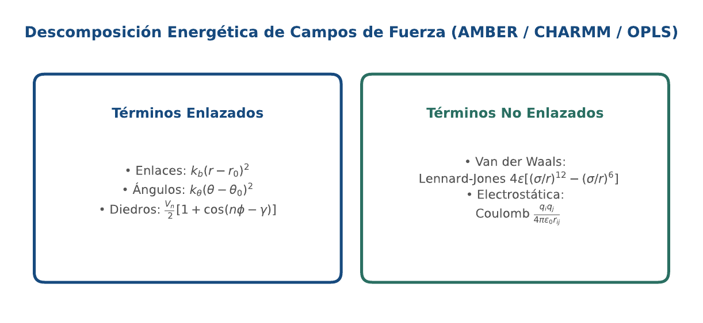
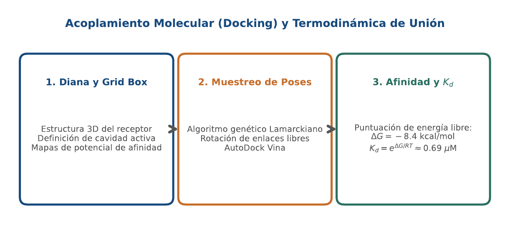
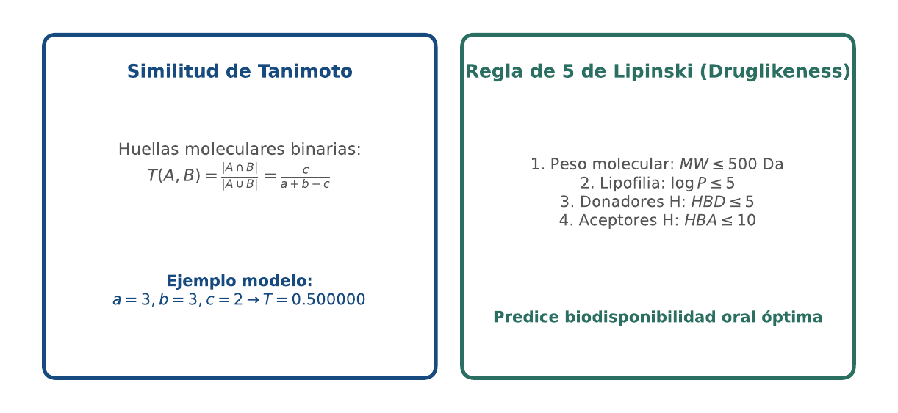

# BC14 · Dinámica Molecular, Docking y Cribado Virtual

<div class="admonition note">
<p class="admonition-title">Bloque IV: Estructura, Dinámica y Biomedicina Computacional</p>
<p>Dinámica molecular clásica (Verlet, campos de fuerza), docking con AutoDock Vina, conversión termodinámica a Kd, similitud de Tanimoto y Regla de 5 de Lipinski.</p>
</div>

!!! warning "Entrega Oficial en Campus Virtual"
    **Importante:** La entrega, evaluación y calificación oficial de esta práctica se realiza **exclusivamente a través del Campus Virtual**. Los kits descargables aquí son para experimentación y autoevaluación local (`check_practice_delivery.sh`).

---

=== "📖 Capítulo Teórico & Pseudocódigo"

    !!! info "📖 Material de Estudio Teórico (v4.0 · edición 2)"
        Puede consultar y descargar el capítulo individual en formato PDF para preparar esta sesión:

        [📥 Descargar Capítulo BC14 (PDF · v4.0)](../assets/capitulos/BC14_capitulo_v4.0.pdf){ .md-button .md-button--primary }


        [📚 Descargar el libro completo (PDF · v4.0)](../assets/libros/BC-libro_v4.0.pdf){ .md-button }

    ### Algoritmo Estructurado y Especificación Formal

    ```text
ALGORITMO: Evaluacion_Regla_5_Lipinski
ENTRADA: Peso Molecular MW, Lipofilia LogP, Donadores HBD, Aceptores HBA
SALIDA: Numero de violaciones, Booleano Drug_Like

1. Violaciones <- 0
2. Si MW > 500.0: Violaciones <- Violaciones + 1
3. Si LogP > 5.0: Violaciones <- Violaciones + 1
4. Si HBD > 5: Violaciones <- Violaciones + 1
5. Si HBA > 10: Violaciones <- Violaciones + 1
6. Drug_Like <- (Violaciones <= 1)
7. Retornar (Violaciones, Drug_Like)
    ```

    ???+ info "Complejidad Asintótica Formal"
        **Análisis:** O(1) evaluación de propiedades fisicoquímicas.

=== "📊 Diagramas Vectoriales"

    ### Diagrama Conceptual de Referencia (Figura 1)

    

    *Descomposición energética: potenciales enlazados (enlaces, ángulos, diedros) y no enlazados (Lennard-Jones y Coulomb).*

    ---

    ### Esquemas Complementarios del Capítulo

    <div class="grid cards" markdown>
    - 
    - 
    </div>

=== "💻 Laboratorio & Descarga de Kit"

    ### Práctica 14: Cribado Virtual, Docking y Fármaco-Similitud

    Integración del paso de posición de Verlet, conversión de afinidad delta G a Kd micromolar, similitud de Tanimoto y cribado de Lipinski.

    [📥 Descargar Kit de Práctica (kit_BC14.tar.gz)](../assets/kits/kit_BC14.tar.gz){ .md-button .md-button--primary }

    #### 1. Inicialización del Espacio de Trabajo
    ```bash
    tar -xzf kit_BC14.tar.gz
    bash create_workspace.sh MiEntrega_BC14
    cd MiEntrega_BC14
    ```

    #### 2. Autoevaluación Local (DELIVERY_OK)
    ```bash
    bash check_practice_delivery.sh MiEntrega_BC14
    # Debe emitir: [DELIVERY_OK] Practica BC14 verificada con exito (3.0 / 3.0 pts)
    ```

    #### 3. Empaquetado y Entrega en Campus Virtual
    Comprima su carpeta de entrega conteniendo sus scripts y súbala al Campus Virtual:
    ```bash
    tar -czf MiEntrega_BC14.tar.gz MiEntrega_BC14/
    ```

=== "⚡ Recursos Interactivos"

    ### Espacio de Experimentación y Modelado Computacional

    <div class="admonition tip">
    <p class="admonition-title">Entorno Interactivo y Datos Reproducibles</p>
    <p>Este módulo cuenta con implementaciones deterministas en Python 3.9 estándar (<code>SEED=42</code>) y oráculos formales incluidos en el kit de práctica.</p>
    </div>

=== "📋 Rúbrica ADR-001 (30/70)"

    ### Criterios Estandarizados de Evaluación

    | Componente | Peso | Criterio de Evaluación |
    | :--- | :---: | :--- |
    | **Entrega Técnica Automatizada** | **30% (3.0 pts)** | Cálculo termodinámico de Kd exacto (1.0), filtro de Lipinski funcional (1.0) y paso de Verlet verificado (1.0). |
    | **Razonamiento Bioinformático & Robustez** | **70% (7.0 pts)** | Limitaciones del docking de receptor rígido y necesidad del ajuste inducido (30%), interpretación de huellas 2D en cribado masivo (20%) y síntesis integradora de la asignatura (20%). |

    !!! note "Marco de IA Responsable"
        - **Permitido con declaración:** Lluvia de ideas, depuración de sintaxis y consultas conceptuales.
        - **Restringido:** Generación directa de soluciones de entrega sin comprensión o verificación formal.
        - **No permitido:** Invención de referencias bibliográficas, alteración de datos experimentales o entrega no comprendida.

---

[Volver al Índice de Biología Computacional](index.md){ .md-button }
