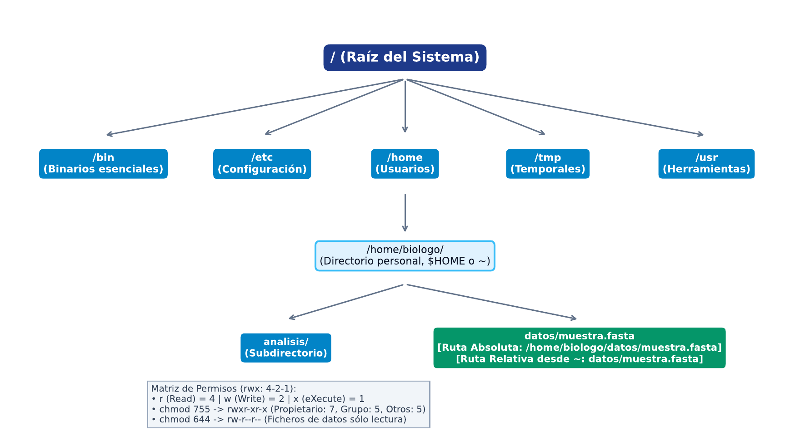

# TC01 · Entorno, Sistemas y Diagnóstico POSIX

<div class="admonition note">
<p class="admonition-title">Bloque I: Entorno, Sistemas y Algoritmos Fundamentales</p>
<p>Fundamentos del sistema operativo Linux, modelo de procesos, jerarquía de directorios POSIX, streams estándar (stdin, stdout, stderr), permisos octales y diagnóstico reproducible.</p>
</div>

!!! warning "Entrega Oficial en Campus Virtual"
    **Importante:** La entrega, evaluación y calificación oficial de esta práctica se realiza **exclusivamente a través del Campus Virtual**. Los kits descargables aquí son para experimentación y autoevaluación local (`check_practice_delivery.sh`).

---

=== "📖 Capítulo Teórico & Pseudocódigo"


    !!! info "📖 Material de Estudio Teórico (v2.2)"
        Puede consultar y descargar el capítulo individual en formato PDF para preparar esta sesión:

        [📥 Descargar Capítulo TC01 (PDF · v2.2)](../assets/capitulos/TC01_capitulo_v2.2.pdf){ .md-button .md-button--primary }


    ### Algoritmo Estructurado y Especificación Formal

    ```text
ALGORITMO: Diagnostico_Rutas_y_Permisos_POSIX
ENTRADA: Ruta R, Permiso_Requerido P in {r, w, x}
SALIDA: Estado in {OK, ERROR_NO_EXISTE, ERROR_PERMISO, ERROR_TIPO}

1. Si NO Existe(R): Retornar ERROR_NO_EXISTE
2. Si NO Es_Directorio(R) Y Es_Directorio_Esperado(R): Retornar ERROR_TIPO
3. Si NO Tiene_Permiso(R, P): Retornar ERROR_PERMISO
4. Retornar OK (Acceso valido)
    ```

    ???+ info "Complejidad Asintótica Formal"
        **Análisis:** O(d) donde d es la profundidad del path en el árbol de inodos.

=== "📊 Diagrama Vectorial"

    ### Diagrama Conceptual de Referencia

    

    *Árbol de directorios POSIX (/bin, /etc, /home, /var) y permisos rwx para Owner, Group y Others.*

=== "💻 Laboratorio & Descarga de Kit"

    ### Práctica 1: Entorno de Laboratorio y Automatización Shell

    Despliegue del entorno de trabajo, filtrado de streams POSIX con tuberías, verificación de permisos y generación de notas/respuestas.tsv.

    [📥 Descargar Kit de Práctica (kit_TC01.tar.gz)](../assets/kits/kit_TC01.tar.gz){ .md-button .md-button--primary }

    #### 1. Inicialización del Espacio de Trabajo
    ```bash
    tar -xzf kit_TC01.tar.gz
    bash create_workspace.sh MiEntrega_TC01
    cd MiEntrega_TC01
    ```

    #### 2. Autoevaluación Local (DELIVERY_OK)
    ```bash
    bash check_practice_delivery.sh MiEntrega_TC01
    # Debe emitir: [DELIVERY_OK] (3.0 / 3.0 pts)
    ```

    #### 3. Empaquetado y Entrega en Campus Virtual
    Comprima su carpeta de entrega conteniendo `notas/respuestas.tsv` y súbala al Campus Virtual:
    ```bash
    tar -czf MiEntrega_TC01.tar.gz MiEntrega_TC01/
    ```

=== "⚡ Recursos Interactivos"

    ### Espacio de Experimentación y Simulación

    <div class="admonition tip">
    <p class="admonition-title">Entorno Interactivo y Datos Reproducibles</p>
    <p>Este módulo cuenta con datasets sintéticos generados de forma determinista (<code>SEED=42</code>) y scripts en streaming incluidos en el kit de práctica.</p>
    </div>

    *(Espacio reservado para widgets interactivos adicionales en HTML5 / WebAssembly / Pyodide).*

=== "📋 Rúbrica ADR-001 (30/70)"

    ### Criterios Estandarizados de Evaluación

    | Componente | Peso | Criterio de Evaluación |
    | :--- | :---: | :--- |
    | **Entrega Técnica Automatizada** | **30% (3.0 pts)** | Superación de check_practice_delivery.sh (1.0), estructura de directorios correcta (1.0), y permisos octales adecuados (1.0). |
    | **Razonamiento Conceptual & Robustez** | **70% (7.0 pts)** | Explicación de la diferencia entre rutas relativas y absolutas (30%), diagnóstico de redirecciones de streams 2>&1 (20%), y justificación del aislamiento de procesos (20%). |

    !!! note "Marco de IA Responsable"
        - **Permitido con declaración:** Lluvia de ideas, depuración de errores y explicaciones alternativas.
        - **Restringido:** Código generado para entregables (requiere traza de prompt y verificación).
        - **No permitido:** Datos sensibles, invención de fuentes o entrega de código no comprendido.

---

[Volver al Índice de Técnicas Computacionales](index.md){ .md-button }
