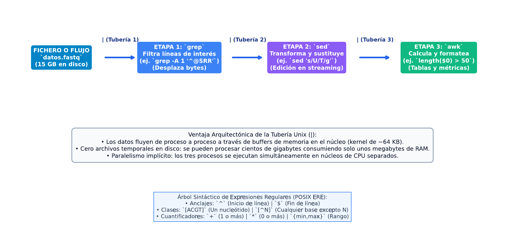

# TC02 · Procesamiento de Texto y Pipelines Streaming

<div class="admonition note">
<p class="admonition-title">Bloque I: Entorno, Sistemas y Algoritmos Fundamentales</p>
<p>Tratamiento de secuencias biológicas como flujos de datos en streaming (O(1) memoria por línea) mediante utilidades Unix (grep, sed, awk, cut, sort) y parsers FASTA multilínea.</p>
</div>

!!! warning "Entrega Oficial en Campus Virtual"
    **Importante:** La entrega, evaluación y calificación oficial de esta práctica se realiza **exclusivamente a través del Campus Virtual**. Los kits descargables aquí son para experimentación y autoevaluación local (`check_practice_delivery.sh`).

---

=== "📖 Capítulo Teórico & Pseudocódigo"


    !!! info "📖 Material de Estudio Teórico (v2.2)"
        Puede consultar y descargar el capítulo individual en formato PDF para preparar esta sesión:

        [📥 Descargar Capítulo TC02 (PDF · v2.2)](../assets/capitulos/TC02_capitulo_v2.2.pdf){ .md-button .md-button--primary }


    ### Algoritmo Estructurado y Especificación Formal

    ```text
ALGORITMO: Parser_FASTA_Multilinea_Streaming
ENTRADA: Flujo_Texto (Stream de lineas FASTA)
SALIDA: Secuencia de pares (Cabecera, Secuencia_Normalizada)
COMPLEJIDAD: O(L) tiempo, O(max_len) espacio

1. Cabecera_Actual <- Vacio; Secuencia_Actual <- Vacio
2. Para cada Linea en Flujo_Texto:
     Si Linea comienza por '>':
       Si Cabecera_Actual NO es Vacio:
         Emitir (Cabecera_Actual, Secuencia_Actual)
       Cabecera_Actual <- Subcadena(Linea, 2)
       Secuencia_Actual <- Vacio
     Sino:
       Secuencia_Actual <- Secuencia_Actual + Limpiar(Linea)
3. Si Cabecera_Actual NO es Vacio:
     Emitir (Cabecera_Actual, Secuencia_Actual)
    ```

    ???+ info "Complejidad Asintótica Formal"
        **Análisis:** O(N) tiempo lineal, O(1) memoria auxiliar respecto al tamaño total del archivo.

=== "📊 Diagrama Vectorial"

    ### Diagrama Conceptual de Referencia

    

    *Pipeline de streaming: Lectura secuencial, normalización con AWK y filtrado sin almacenar el archivo completo en RAM.*

=== "💻 Laboratorio & Descarga de Kit"

    ### Práctica 2: Parser Streaming y Estadísticas de Secuencias

    Procesamiento de archivos FASTA multilínea con AWK, cálculo de contenido GC por secuencia y control de memoria en streaming.

    [📥 Descargar Kit de Práctica (kit_TC02.tar.gz)](../assets/kits/kit_TC02.tar.gz){ .md-button .md-button--primary }

    #### 1. Inicialización del Espacio de Trabajo
    ```bash
    tar -xzf kit_TC02.tar.gz
    bash create_workspace.sh MiEntrega_TC02
    cd MiEntrega_TC02
    ```

    #### 2. Autoevaluación Local (DELIVERY_OK)
    ```bash
    bash check_practice_delivery.sh MiEntrega_TC02
    # Debe emitir: [DELIVERY_OK] (3.0 / 3.0 pts)
    ```

    #### 3. Empaquetado y Entrega en Campus Virtual
    Comprima su carpeta de entrega conteniendo `notas/respuestas.tsv` y súbala al Campus Virtual:
    ```bash
    tar -czf MiEntrega_TC02.tar.gz MiEntrega_TC02/
    ```

=== "⚡ Recursos Interactivos"

    ### Espacio de Experimentación y Simulación

    <div class="admonition tip">
    <p class="admonition-title">Entorno Interactivo y Datos Reproducibles</p>
    <p>Este módulo cuenta con datasets sintéticos generados de forma determinista (<code>SEED=42</code>) y scripts en streaming incluidos en el kit de práctica.</p>
    </div>

    *(Espacio reservado para widgets interactivos adicionales en HTML5 / WebAssembly / Pyodide).*

=== "📋 Rúbrica ADR-001 (30/70)"

    ### Criterios Estandarizados de Evaluación

    | Componente | Peso | Criterio de Evaluación |
    | :--- | :---: | :--- |
    | **Entrega Técnica Automatizada** | **30% (3.0 pts)** | Lectura correcta de FASTA multilínea (1.0), salida en TSV sin errores (1.0) y script ejecutable (1.0). |
    | **Razonamiento Conceptual & Robustez** | **70% (7.0 pts)** | Demostración del consumo O(1) en memoria (30%), gestión de casos límite como líneas vacías o caracteres ambiguos (20%), y validación de expresiones regulares (20%). |

    !!! note "Marco de IA Responsable"
        - **Permitido con declaración:** Lluvia de ideas, depuración de errores y explicaciones alternativas.
        - **Restringido:** Código generado para entregables (requiere traza de prompt y verificación).
        - **No permitido:** Datos sensibles, invención de fuentes o entrega de código no comprendido.

---

[Volver al Índice de Técnicas Computacionales](index.md){ .md-button }
