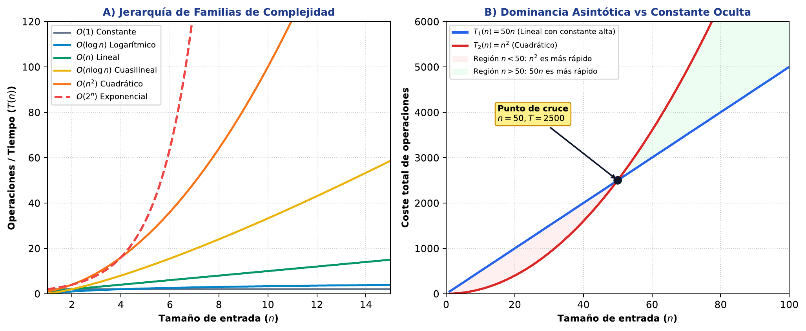

# TC03 · Diseño de Algoritmos y Complejidad Asintótica

<div class="admonition note">
<p class="admonition-title">Bloque I: Entorno, Sistemas y Algoritmos Fundamentales</p>
<p>Análisis asintótico formal (notación Big-O), comparación de paradigmas de diseño (Voraz / Greedy, Divide y Vencerás, Programación Dinámica) y curvas empíricas de escalabilidad.</p>
</div>

!!! warning "Entrega Oficial en Campus Virtual"
    **Importante:** La entrega, evaluación y calificación oficial de esta práctica se realiza **exclusivamente a través del Campus Virtual**. Los kits descargables aquí son para experimentación y autoevaluación local (`check_practice_delivery.sh`).

---

=== "📖 Capítulo Teórico & Pseudocódigo"


    !!! info "📖 Material de Estudio Teórico (v2.2)"
        Puede consultar y descargar el capítulo individual en formato PDF para preparar esta sesión:

        [📥 Descargar Capítulo TC03 (PDF · v2.2)](../assets/capitulos/TC03_capitulo_v2.2.pdf){ .md-button .md-button--primary }


    ### Algoritmo Estructurado y Especificación Formal

    ```text
ALGORITMO: Fibonacci_DP_Iterativo_Optimo
ENTRADA: Entero n >= 0
SALIDA: F(n)
COMPLEJIDAD: O(n) tiempo, O(1) espacio

1. Si n = 0: Retornar 0; Si n = 1: Retornar 1
2. prev2 <- 0; prev1 <- 1; actual <- 0
3. Para i desde 2 hasta n:
     actual <- prev1 + prev2
     prev2 <- prev1
     prev1 <- actual
4. Retornar actual
    ```

    ???+ info "Complejidad Asintótica Formal"
        **Análisis:** O(n) tiempo, O(1) espacio frente a la solución recursiva ingenua O(2^n).

=== "📊 Diagrama Vectorial"

    ### Diagrama Conceptual de Referencia

    

    *Comparativa de complejidad temporal: de algoritmos sublineales a explosión exponencial en problemas genómicos.*

=== "💻 Laboratorio & Descarga de Kit"

    ### Práctica 3: Benchmark Empírico y Programación Dinámica

    Medición de tiempos de ejecución con n creciente, ajuste empírico de curvas de complejidad y comparación voraz vs dinámico.

    [📥 Descargar Kit de Práctica (kit_TC03.tar.gz)](../assets/kits/kit_TC03.tar.gz){ .md-button .md-button--primary }

    #### 1. Inicialización del Espacio de Trabajo
    ```bash
    tar -xzf kit_TC03.tar.gz
    bash create_workspace.sh MiEntrega_TC03
    cd MiEntrega_TC03
    ```

    #### 2. Autoevaluación Local (DELIVERY_OK)
    ```bash
    bash check_practice_delivery.sh MiEntrega_TC03
    # Debe emitir: [DELIVERY_OK] (3.0 / 3.0 pts)
    ```

    #### 3. Empaquetado y Entrega en Campus Virtual
    Comprima su carpeta de entrega conteniendo `notas/respuestas.tsv` y súbala al Campus Virtual:
    ```bash
    tar -czf MiEntrega_TC03.tar.gz MiEntrega_TC03/
    ```

=== "⚡ Recursos Interactivos"

    ### Espacio de Experimentación y Simulación

    <div class="admonition tip">
    <p class="admonition-title">Entorno Interactivo y Datos Reproducibles</p>
    <p>Este módulo cuenta con datasets sintéticos generados de forma determinista (<code>SEED=42</code>) y scripts en streaming incluidos en el kit de práctica.</p>
    </div>

    *(Espacio reservado para widgets interactivos adicionales en HTML5 / WebAssembly / Pyodide).*

=== "📋 Rúbrica ADR-001 (30/70)"

    ### Criterios Estandarizados de Evaluación

    | Componente | Peso | Criterio de Evaluación |
    | :--- | :---: | :--- |
    | **Entrega Técnica Automatizada** | **30% (3.0 pts)** | Script de benchmark funcional (1.0), formato de tabla tsv con tiempos (1.0) y DELIVERY_OK (1.0). |
    | **Razonamiento Conceptual & Robustez** | **70% (7.0 pts)** | Análisis formal de recurrencias (30%), interpretación de desviaciones por caching/overhead (20%), y justificación del orden de magnitud (20%). |

    !!! note "Marco de IA Responsable"
        - **Permitido con declaración:** Lluvia de ideas, depuración de errores y explicaciones alternativas.
        - **Restringido:** Código generado para entregables (requiere traza de prompt y verificación).
        - **No permitido:** Datos sensibles, invención de fuentes o entrega de código no comprendido.

---

[Volver al Índice de Técnicas Computacionales](index.md){ .md-button }
