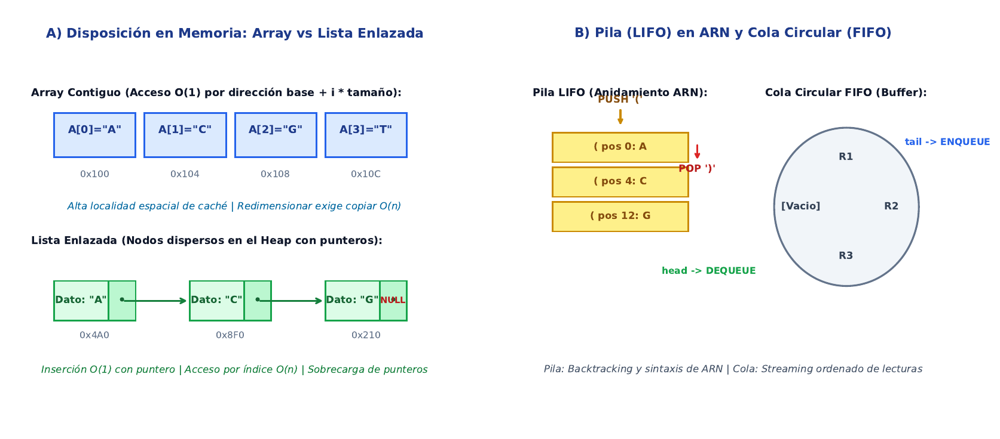

# TC04 · Estructuras de Datos Lineales y Memoria

<div class="admonition note">
<p class="admonition-title">Bloque II: Estructuras de Datos, Búsqueda y Ordenación</p>
<p>Modelos de almacenamiento en memoria física (contiguo vs enlazado), punteros, arreglos dinámicos, pilas (LIFO) para estructuras secundarias de ARN y colas circulares (FIFO) para buffers de lecturas.</p>
</div>

!!! warning "Entrega Oficial en Campus Virtual"
    **Importante:** La entrega, evaluación y calificación oficial de esta práctica se realiza **exclusivamente a través del Campus Virtual**. Los kits descargables aquí son para experimentación y autoevaluación local (`check_practice_delivery.sh`).

!!! info "Manual de la Asignatura"
    El libro de texto completo (*Técnicas Computacionales en Biología*, 215 páginas) es facilitado y distribuido directamente por el profesor responsable de la asignatura.

---

=== "📖 Síntesis & Pseudocódigo"

    ### Algoritmo Estructurado y Especificación Formal

    ```text
ALGORITMO: Pila_Validacion_Estructura_Secundaria_ARN
ENTRADA: Cadena dot-bracket S de longitud n (ej: '((...))..')
SALIDA: Booleano es_valida, Entero num_pares
COMPLEJIDAD: O(n) tiempo, O(n) espacio

1. Pila <- Crear_Pila(); num_pares <- 0
2. Para i desde 1 hasta n:
     c <- S[i]
     Si c = '(': Empujar(Pila, i)
     Sino si c = ')':
       Si Esta_Vacia(Pila): Retornar (Falso, 0)
       apertura <- Sacar(Pila)
       num_pares <- num_pares + 1
3. Si NO Esta_Vacia(Pila): Retornar (Falso, 0)
4. Retornar (Verdadero, num_pares)
    ```

    ???+ info "Complejidad Asintótica Formal"
        **Análisis:** O(n) tiempo por recorrido lineal, O(n) memoria en el peor caso.

=== "📊 Diagrama Vectorial"

    ### Diagrama Conceptual de Referencia

    

    *Disposición en memoria: arrays contiguos con indexación O(1) vs nodos enlazados con punteros, pila de validación ARN y cola circular.*

=== "💻 Laboratorio & Descarga de Kit"

    ### Práctica 4: Validador de ARN y Buffer Circular de Lecturas

    Implementación de validador de estructuras secundarias de ARN con pilas y simulación de buffer de lecturas con punteros modulares.

    <div style="margin: 1.5em 0;">
      <a href="../assets/kits/kit_TC04.tar.gz" class="md-button md-button--primary" download>
        📥 Descargar Kit de Práctica (kit_TC04.tar.gz)
      </a>
    </div>

    #### 1. Inicialización del Espacio de Trabajo
    ```bash
    tar -xzf kit_TC04.tar.gz
    bash create_workspace.sh MiEntrega_TC04
    cd MiEntrega_TC04
    ```

    #### 2. Autoevaluación Local (DELIVERY_OK)
    ```bash
    bash check_practice_delivery.sh MiEntrega_TC04
    # Debe emitir: [DELIVERY_OK] (3.0 / 3.0 pts)
    ```

    #### 3. Empaquetado y Entrega en Campus Virtual
    Comprima su carpeta de entrega conteniendo `notas/respuestas.tsv` y súbala al Campus Virtual:
    ```bash
    tar -czf MiEntrega_TC04.tar.gz MiEntrega_TC04/
    ```

=== "⚡ Recursos Interactivos"

    ### Espacio de Experimentación y Simulación

    <div class="admonition tip">
    <p class="admonition-title">Entorno Interactivo y Datos Reproducibles</p>
    <p>Este módulo cuenta con datasets sintéticos generados de forma determinista (<code>SEED=42</code>) y scripts en streaming incluidos en el kit de práctica.</p>
    </div>

    *(Espacio reservado para widgets interactivos adicionales en HTML5 / WebAssembly / Pyodide).*

=== "📋 Rúbrica ADR-001 (30/70)"

    ### Criterios Estandarizados de Evaluación

    | Componente | Peso | Criterio de Evaluación |
    | :--- | :---: | :--- |
    | **Entrega Técnica Automatizada** | **30% (3.0 pts)** | Validador dot-bracket correcto (1.0), simulación de cola circular FIFO (1.0) y script verificado (1.0). |
    | **Razonamiento Conceptual & Robustez** | **70% (7.0 pts)** | Justificación de costes amortizados O(1) en redimensionamiento de arrays (30%), gestión de desbordamiento (20%), y trade-offs espaciales (20%). |

    !!! note "Marco de IA Responsable"
        - **Permitido con declaración:** Lluvia de ideas, depuración de errores y explicaciones alternativas.
        - **Restringido:** Código generado para entregables (requiere traza de prompt y verificación).
        - **No permitido:** Datos sensibles, invención de fuentes o entrega de código no comprendido.

---

[Volver al Índice de Técnicas Computacionales](index.md){ .md-button }
