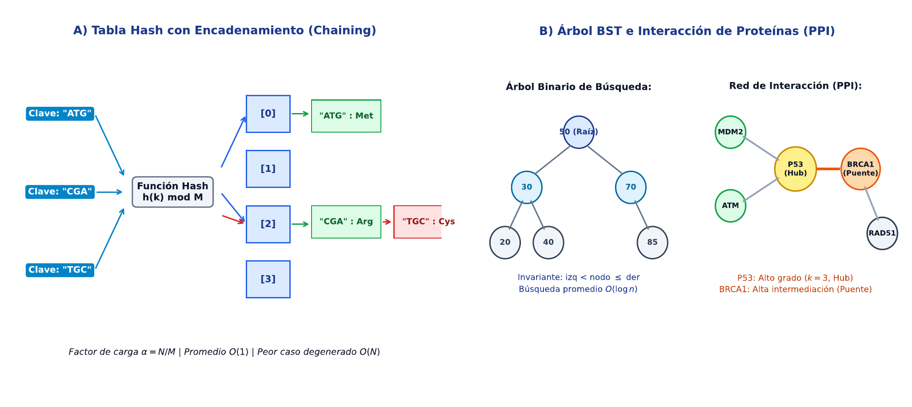

# TC05 · Estructuras No Lineales, Árboles y Grafos

<div class="admonition note">
<p class="admonition-title">Bloque II: Estructuras de Datos, Búsqueda y Ordenación</p>
<p>Tablas Hash y resolución de colisiones, Árboles Binarios de Búsqueda (BST) balanceados, representación de grafos (matrices vs listas de adyacencia) y análisis de redes de interacción proteína-proteína (PPI).</p>
</div>

!!! warning "Entrega Oficial en Campus Virtual"
    **Importante:** La entrega, evaluación y calificación oficial de esta práctica se realiza **exclusivamente a través del Campus Virtual**. Los kits descargables aquí son para experimentación y autoevaluación local (`check_practice_delivery.sh`).

---

=== "📖 Capítulo Teórico & Pseudocódigo"


    !!! info "📖 Material de Estudio Teórico (v4.0 · edición 2)"
        Puede consultar y descargar el capítulo individual en formato PDF para preparar esta sesión:

        [📥 Descargar Capítulo TC05 (PDF · v4.0)](../assets/capitulos/TC05_capitulo_v4.0.pdf){ .md-button .md-button--primary }


        [📚 Descargar el libro completo (PDF · v4.0)](../assets/libros/TC-libro_v4.0.pdf){ .md-button }

    ### Algoritmo Estructurado y Especificación Formal

    ```text
ALGORITMO: Calculo_Centralidad_Grado_Red_Proteica
ENTRADA: Lista_Adyacencia Grafo con V vertices y E aristas
SALIDA: Mapa Grado[Proteina], Proteina Hub_Maximo
COMPLEJIDAD: O(V + E) tiempo, O(V) espacio

1. Grado <- Crear_Diccionario()
2. Para cada vertice u en Vertices(Grafo):
     Grado[u] <- Longitud(Vecinos(Grafo, u))
3. max_g <- -1; Hub_Maximo <- Nulo
4. Para cada (u, g) en Grado:
     Si g > max_g:
       max_g <- g; Hub_Maximo <- u
5. Retornar (Grado, Hub_Maximo)
    ```

    ???+ info "Complejidad Asintótica Formal"
        **Análisis:** O(V + E) tiempo, O(V) espacio.

=== "📊 Diagrama Vectorial"

    ### Diagrama Conceptual de Referencia

    

    *Estructuras no lineales: Tablas Hash con acceso O(1) promedio, BST con búsqueda O(log n) y red proteica PPI con cálculo de centralidad de grado.*

=== "💻 Laboratorio & Descarga de Kit"

    ### Práctica 5: Indexación de K-meros y Análisis de Redes PPI

    Indexación rápida de secuencias con tablas hash, recorrido BFS de grafos de interacción y detección de hubs proteicos esenciales.

    [📥 Descargar Kit de Práctica (kit_TC05.tar.gz)](../assets/kits/kit_TC05.tar.gz){ .md-button .md-button--primary }

    #### 1. Inicialización del Espacio de Trabajo
    ```bash
    tar -xzf kit_TC05.tar.gz
    bash create_workspace.sh MiEntrega_TC05
    cd MiEntrega_TC05
    ```

    #### 2. Autoevaluación Local (DELIVERY_OK)
    ```bash
    bash check_practice_delivery.sh MiEntrega_TC05
    # Debe emitir: [DELIVERY_OK] (3.0 / 3.0 pts)
    ```

    #### 3. Empaquetado y Entrega en Campus Virtual
    Comprima su carpeta de entrega conteniendo `notas/respuestas.tsv` y súbala al Campus Virtual:
    ```bash
    tar -czf MiEntrega_TC05.tar.gz MiEntrega_TC05/
    ```

=== "⚡ Recursos Interactivos"

    ### Espacio de Experimentación y Simulación

    <div class="admonition tip">
    <p class="admonition-title">Entorno Interactivo y Datos Reproducibles</p>
    <p>Este módulo cuenta con datasets sintéticos generados de forma determinista (<code>SEED=42</code>) y scripts en streaming incluidos en el kit de práctica.</p>
    </div>

    *(Espacio reservado para widgets interactivos adicionales en HTML5 / WebAssembly / Pyodide).*

=== "📋 Rúbrica ADR-001 (30/70)"

    ### Criterios Estandarizados de Evaluación

    | Componente | Peso | Criterio de Evaluación |
    | :--- | :---: | :--- |
    | **Entrega Técnica Automatizada** | **30% (3.0 pts)** | Cálculo exacto de grados y hubs (1.0), salida tsv validada (1.0) y script funcional (1.0). |
    | **Razonamiento Conceptual & Robustez** | **70% (7.0 pts)** | Explicación del factor de carga alpha en tablas hash (30%), comparación de matrices vs listas de adyacencia en grafos dispersos (20%), e interpretación biológica de hubs (20%). |

    !!! note "Marco de IA Responsable"
        - **Permitido con declaración:** Lluvia de ideas, depuración de errores y explicaciones alternativas.
        - **Restringido:** Código generado para entregables (requiere traza de prompt y verificación).
        - **No permitido:** Datos sensibles, invención de fuentes o entrega de código no comprendido.

---

[Volver al Índice de Técnicas Computacionales](index.md){ .md-button }
