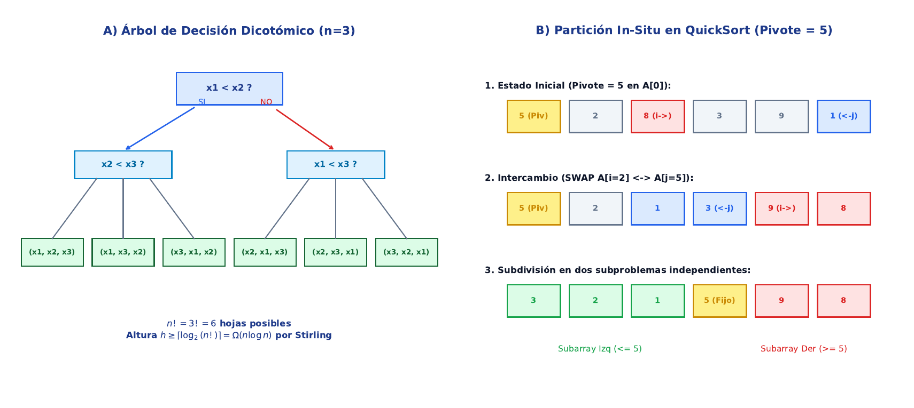

# TC06 · Búsqueda y Algoritmos de Ordenación

<div class="admonition note">
<p class="admonition-title">Bloque II: Estructuras de Datos, Búsqueda y Ordenación</p>
<p>Búsqueda binaria en coordenadas genómicas ordenadas, algoritmos de ordenación por comparación (QuickSort con partición de Hoare, MergeSort) y algoritmos no comparativos lineales (Radix Sort / Counting Sort) para ADN.</p>
</div>

!!! warning "Entrega Oficial en Campus Virtual"
    **Importante:** La entrega, evaluación y calificación oficial de esta práctica se realiza **exclusivamente a través del Campus Virtual**. Los kits descargables aquí son para experimentación y autoevaluación local (`check_practice_delivery.sh`).

!!! info "Manual de la Asignatura"
    El libro de texto completo (*Técnicas Computacionales en Biología*, 215 páginas) es facilitado y distribuido directamente por el profesor responsable de la asignatura.

---

=== "📖 Síntesis & Pseudocódigo"

    ### Algoritmo Estructurado y Especificación Formal

    ```text
ALGORITMO: QuickSort_Particion_Hoare
ENTRADA: Arreglo A, Indices inicio, fin
SALIDA: Arreglo A ordenado in-situ
COMPLEJIDAD: O(n log n) promedio, O(log n) espacio de pila

1. Si inicio < fin:
     p <- Particionar_Hoare(A, inicio, fin)
     QuickSort_Particion_Hoare(A, inicio, p)
     QuickSort_Particion_Hoare(A, p + 1, fin)

FUNCION Particionar_Hoare(A, inicio, fin):
  pivote <- A[inicio]
  i <- inicio - 1; j <- fin + 1
  Bucle infinito:
    Hacer i <- i + 1 Mientras A[i] < pivote
    Hacer j <- j - 1 Mientras A[j] > pivote
    Si i >= j: Retornar j
    Intercambiar(A[i], A[j])
    ```

    ???+ info "Complejidad Asintótica Formal"
        **Análisis:** O(n log n) tiempo esperado, O(1) memoria auxiliar directa (in-situ).

=== "📊 Diagrama Vectorial"

    ### Diagrama Conceptual de Referencia

    

    *Mecanismos de ordenación: Búsqueda binaria O(log n), partición eficiente de Hoare en QuickSort O(n log n) y Radix Sort O(d * (n + k)).*

=== "💻 Laboratorio & Descarga de Kit"

    ### Práctica 6: Ordenación de Variantes Genómicas y Búsqueda Binaria

    Ordenación cromosómica de registros VCF sintéticos, benchmarking de QuickSort vs Radix Sort y búsqueda binaria de intervalos genómicos.

    <div style="margin: 1.5em 0;">
      <a href="../assets/kits/kit_TC06.tar.gz" class="md-button md-button--primary" download>
        📥 Descargar Kit de Práctica (kit_TC06.tar.gz)
      </a>
    </div>

    #### 1. Inicialización del Espacio de Trabajo
    ```bash
    tar -xzf kit_TC06.tar.gz
    bash create_workspace.sh MiEntrega_TC06
    cd MiEntrega_TC06
    ```

    #### 2. Autoevaluación Local (DELIVERY_OK)
    ```bash
    bash check_practice_delivery.sh MiEntrega_TC06
    # Debe emitir: [DELIVERY_OK] (3.0 / 3.0 pts)
    ```

    #### 3. Empaquetado y Entrega en Campus Virtual
    Comprima su carpeta de entrega conteniendo `notas/respuestas.tsv` y súbala al Campus Virtual:
    ```bash
    tar -czf MiEntrega_TC06.tar.gz MiEntrega_TC06/
    ```

=== "⚡ Recursos Interactivos"

    ### Espacio de Experimentación y Simulación

    <div class="admonition tip">
    <p class="admonition-title">Entorno Interactivo y Datos Reproducibles</p>
    <p>Este módulo cuenta con datasets sintéticos generados de forma determinista (<code>SEED=42</code>) y scripts en streaming incluidos en el kit de práctica.</p>
    </div>

    *(Espacio reservado para widgets interactivos adicionales en HTML5 / WebAssembly / Pyodide).*

=== "📋 Rúbrica ADR-001 (30/70)"

    ### Criterios Estandarizados de Evaluación

    | Componente | Peso | Criterio de Evaluación |
    | :--- | :---: | :--- |
    | **Entrega Técnica Automatizada** | **30% (3.0 pts)** | Implementación correcta de ordenación y búsqueda binaria (1.0), formato TSV (1.0) y DELIVERY_OK (1.0). |
    | **Razonamiento Conceptual & Robustez** | **70% (7.0 pts)** | Demostración de estabilidad en ordenaciones compuestas cromosoma/posición (30%), prevención de peores casos cuadráticos con pivotes óptimos (20%), y límites de teoría de la información en comparaciones (20%). |

    !!! note "Marco de IA Responsable"
        - **Permitido con declaración:** Lluvia de ideas, depuración de errores y explicaciones alternativas.
        - **Restringido:** Código generado para entregables (requiere traza de prompt y verificación).
        - **No permitido:** Datos sensibles, invención de fuentes o entrega de código no comprendido.

---

[Volver al Índice de Técnicas Computacionales](index.md){ .md-button }
