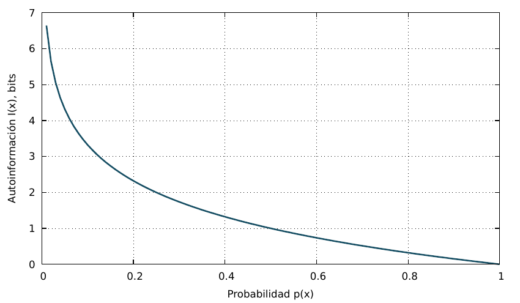

# TC07 · Teoría de la Información y Análisis de Secuencias

<div class="admonition note">
<p class="admonition-title">Bloque III: Información, Modelos Probabilísticos y Aprendizaje</p>
<p>Cuantificación de sorpresa e incertidumbre mediante la entropía de Shannon H(X), información mutua I(X;Y), divergencia de Kullback-Leibler y perfiles de entropía por ventana deslizante para detección de islas genómicas y promotores.</p>
</div>

!!! warning "Entrega Oficial en Campus Virtual"
    **Importante:** La entrega, evaluación y calificación oficial de esta práctica se realiza **exclusivamente a través del Campus Virtual**. Los kits descargables aquí son para experimentación y autoevaluación local (`check_practice_delivery.sh`).

---

=== "📖 Capítulo Teórico & Pseudocódigo"


    !!! info "📖 Material de Estudio Teórico (v4.0 · edición 2)"
        Puede consultar y descargar el capítulo individual en formato PDF para preparar esta sesión:

        [📥 Descargar Capítulo TC07 (PDF · v4.0)](../assets/capitulos/TC07_capitulo_v4.0.pdf){ .md-button .md-button--primary }


        [📚 Descargar el libro completo (PDF · v4.0)](../assets/libros/TC-libro_v4.0.pdf){ .md-button }

    ### Algoritmo Estructurado y Especificación Formal

    ```text
ALGORITMO: Perfil_Entropia_Ventana_Deslizante
ENTRADA: Secuencia S de longitud L, Tamano_Ventana W, Paso S_step
SALIDA: Lista de pares (Posicion_Centro, Entropia_Shannon_H)
COMPLEJIDAD: O(L) tiempo, O(W) espacio

1. Perfil <- Lista_Vacia()
2. Para i desde 1 hasta (L - W + 1) con paso S_step:
     Ventana <- Subcadena(S, i, W)
     H <- Entropia_Shannon_Secuencia(Ventana)
     centro <- i + Int(W / 2)
     Anadir(Perfil, (centro, H))
3. Retornar Perfil
    ```

    ???+ info "Complejidad Asintótica Formal"
        **Análisis:** O(L) con actualización incremental de histogramas, O(W) espacio.

=== "📊 Diagrama Vectorial"

    ### Diagrama Conceptual de Referencia

    

    *Fundamentos de información: Sorpresa individual frente a probabilidad y escaneo de entropía local a lo largo de un cromosoma.*

=== "💻 Laboratorio & Descarga de Kit"

    ### Práctica 7: Detección de Regiones de Baja Complejidad y Entropía

    Cálculo de entropía de orden cero, comparación de distribuciones observadas vs fondo y detección de repeticiones simples en FASTA.

    [📥 Descargar Kit de Práctica (kit_TC07.tar.gz)](../assets/kits/kit_TC07.tar.gz){ .md-button .md-button--primary }

    #### 1. Inicialización del Espacio de Trabajo
    ```bash
    tar -xzf kit_TC07.tar.gz
    bash create_workspace.sh MiEntrega_TC07
    cd MiEntrega_TC07
    ```

    #### 2. Autoevaluación Local (DELIVERY_OK)
    ```bash
    bash check_practice_delivery.sh MiEntrega_TC07
    # Debe emitir: [DELIVERY_OK] (3.0 / 3.0 pts)
    ```

    #### 3. Empaquetado y Entrega en Campus Virtual
    Comprima su carpeta de entrega conteniendo `notas/respuestas.tsv` y súbala al Campus Virtual:
    ```bash
    tar -czf MiEntrega_TC07.tar.gz MiEntrega_TC07/
    ```

=== "⚡ Recursos Interactivos"

    ### Espacio de Experimentación y Simulación

    <div class="admonition tip">
    <p class="admonition-title">Entorno Interactivo y Datos Reproducibles</p>
    <p>Este módulo cuenta con datasets sintéticos generados de forma determinista (<code>SEED=42</code>) y scripts en streaming incluidos en el kit de práctica.</p>
    </div>

    *(Espacio reservado para widgets interactivos adicionales en HTML5 / WebAssembly / Pyodide).*

=== "📋 Rúbrica ADR-001 (30/70)"

    ### Criterios Estandarizados de Evaluación

    | Componente | Peso | Criterio de Evaluación |
    | :--- | :---: | :--- |
    | **Entrega Técnica Automatizada** | **30% (3.0 pts)** | Cálculo de entropía exacto con 4 decimales (1.0), salida TSV (1.0) y script validado (1.0). |
    | **Razonamiento Conceptual & Robustez** | **70% (7.0 pts)** | Derivación matemática de la normalización logarítmica (30%), interpretación biológica de caídas de entropía en telómeros y microsatélites (20%), y asimetría de divergencia KL (20%). |

    !!! note "Marco de IA Responsable"
        - **Permitido con declaración:** Lluvia de ideas, depuración de errores y explicaciones alternativas.
        - **Restringido:** Código generado para entregables (requiere traza de prompt y verificación).
        - **No permitido:** Datos sensibles, invención de fuentes o entrega de código no comprendido.

---

[Volver al Índice de Técnicas Computacionales](index.md){ .md-button }
