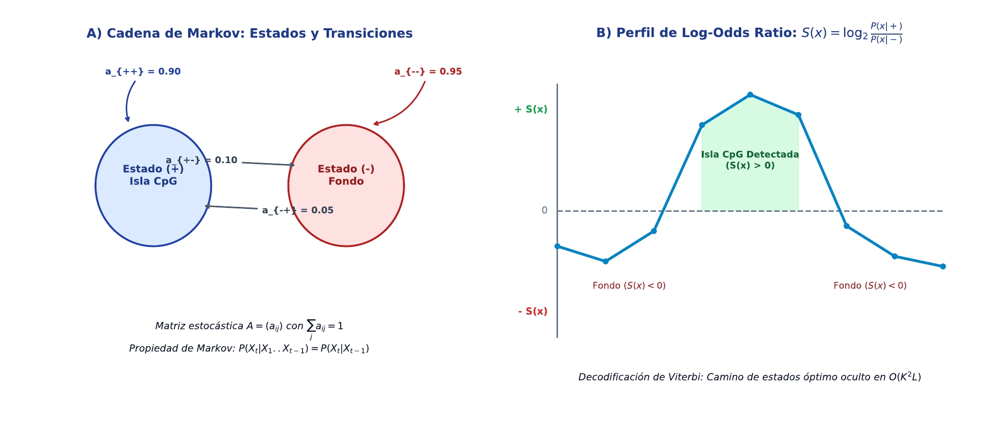

# TC08 · Cadenas de Markov y Modelos Probabilísticos

<div class="admonition note">
<p class="admonition-title">Bloque III: Información, Modelos Probabilísticos y Aprendizaje</p>
<p>Modelos de secuencias basados en probabilidades de transición de primer orden, matrices de transición estocásticas, puntuaciones de log-odds para discriminación de islas CpG y decodificación de estados ocultos mediante el algoritmo de Viterbi (HMM).</p>
</div>

!!! warning "Entrega Oficial en Campus Virtual"
    **Importante:** La entrega, evaluación y calificación oficial de esta práctica se realiza **exclusivamente a través del Campus Virtual**. Los kits descargables aquí son para experimentación y autoevaluación local (`check_practice_delivery.sh`).

---

=== "📖 Capítulo Teórico & Pseudocódigo"


    !!! info "📖 Material de Estudio Teórico (v2.2)"
        Puede consultar y descargar el capítulo individual en formato PDF para preparar esta sesión:

        [📥 Descargar Capítulo TC08 (PDF · v2.2)](../assets/capitulos/TC08_capitulo_v2.2.pdf){ .md-button .md-button--primary }


    ### Algoritmo Estructurado y Especificación Formal

    ```text
ALGORITMO: HMM_Algoritmo_Viterbi_Decodificacion
ENTRADA: Observaciones X = x1...xT, Estados S = {CpG, Fondo},
         Matriz Transicion A, Matriz Emision E, Prob Iniciales PI
SALIDA: Secuencia de estados mas probable Q* = q1*...qT*
COMPLEJIDAD: O(K^2 * T) tiempo, O(K * T) espacio

1. INICIALIZACION (t = 1):
     Para cada estado k in S:
       V[k, 1] <- log(PI[k]) + log(E[k, x1])
       Puntero[k, 1] <- 0
2. RECURSION (t = 2 hasta T):
     Para cada estado k in S:
       V[k, t] <- max_j (V[j, t-1] + log(A[j, k])) + log(E[k, xt])
       Puntero[k, t] <- argmax_j (V[j, t-1] + log(A[j, k]))
3. TERMINACION Y BACKTRACKING:
     qT* <- argmax_k (V[k, T])
     Para t desde T bajando hasta 2:
       qt-1* <- Puntero[qt*, t]
4. Retornar Q* = [q1*, ..., qT*]
    ```

    ???+ info "Complejidad Asintótica Formal"
        **Análisis:** O(K^2 * T) tiempo con K estados y T observaciones; O(K * T) espacio.

=== "📊 Diagrama Vectorial"

    ### Diagrama Conceptual de Referencia

    

    *Modelos de Markov: Grafo estocástico con 4 estados (A, C, G, T), matriz de transición y discriminación mediante Log-Odds ratios.*

=== "💻 Laboratorio & Descarga de Kit"

    ### Práctica 8: Clasificador Log-Odds de Islas CpG

    Entrenamiento de matrices de transición en modelo CpG vs Fondo genómico y clasificación probabilística de secuencias problema.

    [📥 Descargar Kit de Práctica (kit_TC08.tar.gz)](../assets/kits/kit_TC08.tar.gz){ .md-button .md-button--primary }

    #### 1. Inicialización del Espacio de Trabajo
    ```bash
    tar -xzf kit_TC08.tar.gz
    bash create_workspace.sh MiEntrega_TC08
    cd MiEntrega_TC08
    ```

    #### 2. Autoevaluación Local (DELIVERY_OK)
    ```bash
    bash check_practice_delivery.sh MiEntrega_TC08
    # Debe emitir: [DELIVERY_OK] (3.0 / 3.0 pts)
    ```

    #### 3. Empaquetado y Entrega en Campus Virtual
    Comprima su carpeta de entrega conteniendo `notas/respuestas.tsv` y súbala al Campus Virtual:
    ```bash
    tar -czf MiEntrega_TC08.tar.gz MiEntrega_TC08/
    ```

=== "⚡ Recursos Interactivos"

    ### Espacio de Experimentación y Simulación

    <div class="admonition tip">
    <p class="admonition-title">Entorno Interactivo y Datos Reproducibles</p>
    <p>Este módulo cuenta con datasets sintéticos generados de forma determinista (<code>SEED=42</code>) y scripts en streaming incluidos en el kit de práctica.</p>
    </div>

    *(Espacio reservado para widgets interactivos adicionales en HTML5 / WebAssembly / Pyodide).*

=== "📋 Rúbrica ADR-001 (30/70)"

    ### Criterios Estandarizados de Evaluación

    | Componente | Peso | Criterio de Evaluación |
    | :--- | :---: | :--- |
    | **Entrega Técnica Automatizada** | **30% (3.0 pts)** | Cálculo exacto de log-odds ratios (1.0), formato de clasificación TSV (1.0) y script verificado (1.0). |
    | **Razonamiento Conceptual & Robustez** | **70% (7.0 pts)** | Justificación del uso de log-odds para evitar subdesbordamiento numérico (underflow) (30%), análisis del equilibrio estacionario (20%), y validación en datos biológicos reales (20%). |

    !!! note "Marco de IA Responsable"
        - **Permitido con declaración:** Lluvia de ideas, depuración de errores y explicaciones alternativas.
        - **Restringido:** Código generado para entregables (requiere traza de prompt y verificación).
        - **No permitido:** Datos sensibles, invención de fuentes o entrega de código no comprendido.

---

[Volver al Índice de Técnicas Computacionales](index.md){ .md-button }
