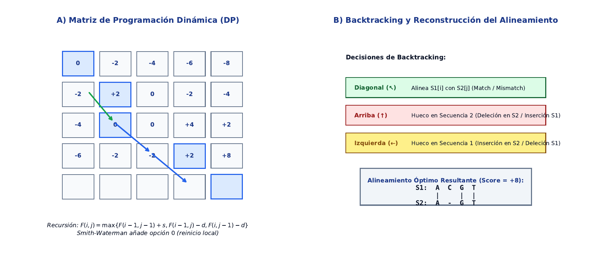

# TC09 · Alineamiento de Secuencias y Programación Dinámica

<div class="admonition note">
<p class="admonition-title">Bloque III: Información, Modelos Probabilísticos y Aprendizaje</p>
<p>Alineamiento global óptimo (Needleman-Wunsch) y alineamiento local (Smith-Waterman), matrices de sustitución (BLOSUM62, PAM250), modelos de penalización por hueco afines (gap opening vs extension) y reconstrucción por backtracking.</p>
</div>

!!! warning "Entrega Oficial en Campus Virtual"
    **Importante:** La entrega, evaluación y calificación oficial de esta práctica se realiza **exclusivamente a través del Campus Virtual**. Los kits descargables aquí son para experimentación y autoevaluación local (`check_practice_delivery.sh`).

!!! info "Manual de la Asignatura"
    El libro de texto completo (*Técnicas Computacionales en Biología*, 215 páginas) es facilitado y distribuido directamente por el profesor responsable de la asignatura.

---

=== "📖 Síntesis & Pseudocódigo"

    ### Algoritmo Estructurado y Especificación Formal

    ```text
ALGORITMO: Needleman_Wunsch_Alineamiento_Global
ENTRADA: Secuencia X (longitud n), Secuencia Y (longitud m),
         Matriz S(a,b), Penalizacion Gap d
SALIDA: Puntuacion Optima F(n,m), Alineamiento_X, Alineamiento_Y
COMPLEJIDAD: O(n * m) tiempo, O(n * m) espacio

1. INICIALIZACION:
     F(0,0) <- 0
     Para i desde 1 hasta n: F(i,0) <- i * d
     Para j desde 1 hasta m: F(0,j) <- j * d
2. LLENADO DE LA MATRIZ:
     Para i desde 1 hasta n:
       Para j desde 1 hasta m:
         diag <- F(i-1, j-1) + S(X[i], Y[j])
         arriba <- F(i-1, j) + d
         izq <- F(i, j-1) + d
         F(i,j) <- max(diag, arriba, izq)
3. BACKTRACKING:
     Reconstruir el camino desde (n,m) hasta (0,0) para obtener las cadenas alineadas.
4. Retornar (F(n,m), Alineamiento_X, Alineamiento_Y)
    ```

    ???+ info "Complejidad Asintótica Formal"
        **Análisis:** O(n * m) tiempo y espacio cuadrático respecto a las longitudes.

=== "📊 Diagrama Vectorial"

    ### Diagrama Conceptual de Referencia

    

    *Programación dinámica en alineamiento: Matriz F(i,j) evaluando diagonal (match/mismatch), arriba (gap en Y) e izquierda (gap en X) con backtracking.*

=== "💻 Laboratorio & Descarga de Kit"

    ### Práctica 9: Alineamiento Global y Local con Matrices de Sustitución

    Implementación de algoritmo de alineamiento con penalización afín, alineamiento de pares homólogos y reconstrucción de trazas.

    <div style="margin: 1.5em 0;">
      <a href="../assets/kits/kit_TC09.tar.gz" class="md-button md-button--primary" download>
        📥 Descargar Kit de Práctica (kit_TC09.tar.gz)
      </a>
    </div>

    #### 1. Inicialización del Espacio de Trabajo
    ```bash
    tar -xzf kit_TC09.tar.gz
    bash create_workspace.sh MiEntrega_TC09
    cd MiEntrega_TC09
    ```

    #### 2. Autoevaluación Local (DELIVERY_OK)
    ```bash
    bash check_practice_delivery.sh MiEntrega_TC09
    # Debe emitir: [DELIVERY_OK] (3.0 / 3.0 pts)
    ```

    #### 3. Empaquetado y Entrega en Campus Virtual
    Comprima su carpeta de entrega conteniendo `notas/respuestas.tsv` y súbala al Campus Virtual:
    ```bash
    tar -czf MiEntrega_TC09.tar.gz MiEntrega_TC09/
    ```

=== "⚡ Recursos Interactivos"

    ### Espacio de Experimentación y Simulación

    <div class="admonition tip">
    <p class="admonition-title">Entorno Interactivo y Datos Reproducibles</p>
    <p>Este módulo cuenta con datasets sintéticos generados de forma determinista (<code>SEED=42</code>) y scripts en streaming incluidos en el kit de práctica.</p>
    </div>

    *(Espacio reservado para widgets interactivos adicionales en HTML5 / WebAssembly / Pyodide).*

=== "📋 Rúbrica ADR-001 (30/70)"

    ### Criterios Estandarizados de Evaluación

    | Componente | Peso | Criterio de Evaluación |
    | :--- | :---: | :--- |
    | **Entrega Técnica Automatizada** | **30% (3.0 pts)** | Puntuación de alineamiento óptima verificada (1.0), reconstrucción de secuencia alineada (1.0) y DELIVERY_OK (1.0). |
    | **Razonamiento Conceptual & Robustez** | **70% (7.0 pts)** | Explicación de la condición de no negatividad en Smith-Waterman para identificar dominios locales (30%), impacto de la penalización afín en la biologicidad del alineamiento (20%), y optimización espacial lineal de Hirschberg (20%). |

    !!! note "Marco de IA Responsable"
        - **Permitido con declaración:** Lluvia de ideas, depuración de errores y explicaciones alternativas.
        - **Restringido:** Código generado para entregables (requiere traza de prompt y verificación).
        - **No permitido:** Datos sensibles, invención de fuentes o entrega de código no comprendido.

---

[Volver al Índice de Técnicas Computacionales](index.md){ .md-button }
