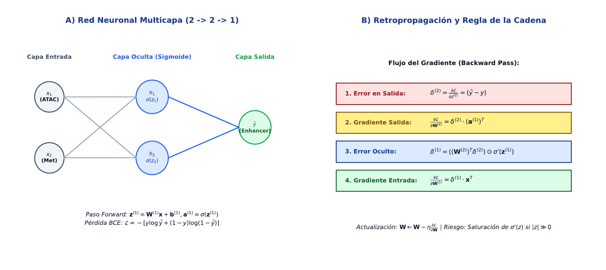

# TC10 · Redes Neuronales para Bioinformática

<div class="admonition note">
<p class="admonition-title">Bloque III: Información, Modelos Probabilísticos y Aprendizaje</p>
<p>Fundamentos del Perceptrón Multicapa (MLP), funciones de activación continuas y diferenciables (Sigmoide, ReLU), propagación hacia adelante (forward pass), algoritmo de retropropagación de errores (backpropagation) mediante la regla de la cadena, descenso de gradiente y predicción de elementos regulatorios (enhancers) a partir de biomarcadores epigenómicos.</p>
</div>

!!! warning "Entrega Oficial en Campus Virtual"
    **Importante:** La entrega, evaluación y calificación oficial de esta práctica se realiza **exclusivamente a través del Campus Virtual**. Los kits descargables aquí son para experimentación y autoevaluación local (`check_practice_delivery.sh`).

---

=== "📖 Capítulo Teórico & Pseudocódigo"


    <div style="margin: 1.5em 0;" class="admonition info">
      <p class="admonition-title">📖 Capítulo Teórico Disponible (v2.2)</p>
      <p>Puede consultar y descargar el capítulo teórico individual en formato PDF para preparar esta sesión:</p>
      <p>
        <a href="../assets/capitulos/TC10_capitulo_v2.2.pdf" class="md-button md-button--primary" download>
          📥 Descargar Capítulo TC10 (PDF · v2.2)
        </a>
      </p>
      
    </div>


    ### Algoritmo Estructurado y Especificación Formal

    ```text
ALGORITMO: Red_Neuronal_Forward_Backward_2x2x1
ENTRADA: Vector de entrada x = [x1, x2], Etiqueta real y in {0,1},
         Tasa aprendizaje eta, Parametros actuales (W1, b1, W2, b2)
SALIDA: Prediccion y_hat, Perdida_BCE, Parametros actualizados (W1*, b1*, W2*, b2*)
COMPLEJIDAD: O(1) tiempo por iteracion, O(1) espacio

1. FORWARD PASS:
   z1 <- W1 * x + b1; a1 <- sigma(z1)
   z2 <- W2 * a1 + b2; y_hat <- sigma(z2)
   Perdida_BCE <- - (y * log(y_hat) + (1 - y) * log(1 - y_hat))

2. BACKWARD PASS (Regla de la cadena):
   delta_salida <- y_hat - y
   grad_W2 <- delta_salida * a1^T; grad_b2 <- delta_salida
   delta_oculto <- (W2^T * delta_salida) * [a1 * (1 - a1)]
   grad_W1 <- delta_oculto * x^T; grad_b1 <- delta_oculto

3. ACTUALIZACION (Descenso de Gradiente):
   W2* <- W2 - eta * grad_W2; b2* <- b2 - eta * grad_b2
   W1* <- W1 - eta * grad_W1; b1* <- b1 - eta * grad_b1
4. Retornar (y_hat, Perdida_BCE, W1*, b1*, W2*, b2*)
    ```

    ???+ info "Complejidad Asintótica Formal"
        **Análisis:** O(1) operaciones algebraicas por muestra con dimensión fija.

=== "📊 Diagrama Vectorial"

    ### Diagrama Conceptual de Referencia

    

    *Red neuronal multicapa: Capa de entrada (biomarcadores epigenéticos ATAC-seq y metilación), capa oculta con activación sigmoide, nodo de salida y retropropagación de gradientes con pérdida BCE.*

=== "💻 Laboratorio & Descarga de Kit"

    ### Práctica 10: Clasificación Epigenómica de Enhancers y Paso Backward

    Evaluación del paso forward y backward en una red 2x2x1, cálculo de la pérdida BCE y actualización determinista de pesos sinápticos.

    <div style="margin: 1.5em 0;">
      <a href="../assets/kits/kit_TC10.tar.gz" class="md-button md-button--primary" download>
        📥 Descargar Kit de Práctica (kit_TC10.tar.gz)
      </a>
    </div>

    #### 1. Inicialización del Espacio de Trabajo
    ```bash
    tar -xzf kit_TC10.tar.gz
    bash create_workspace.sh MiEntrega_TC10
    cd MiEntrega_TC10
    ```

    #### 2. Autoevaluación Local (DELIVERY_OK)
    ```bash
    bash check_practice_delivery.sh MiEntrega_TC10
    # Debe emitir: [DELIVERY_OK] (3.0 / 3.0 pts)
    ```

    #### 3. Empaquetado y Entrega en Campus Virtual
    Comprima su carpeta de entrega conteniendo `notas/respuestas.tsv` y súbala al Campus Virtual:
    ```bash
    tar -czf MiEntrega_TC10.tar.gz MiEntrega_TC10/
    ```

=== "⚡ Recursos Interactivos"

    ### Espacio de Experimentación y Simulación

    <div class="admonition tip">
    <p class="admonition-title">Entorno Interactivo y Datos Reproducibles</p>
    <p>Este módulo cuenta con datasets sintéticos generados de forma determinista (<code>SEED=42</code>) y scripts en streaming incluidos en el kit de práctica.</p>
    </div>

    *(Espacio reservado para widgets interactivos adicionales en HTML5 / WebAssembly / Pyodide).*

=== "📋 Rúbrica ADR-001 (30/70)"

    ### Criterios Estandarizados de Evaluación

    | Componente | Peso | Criterio de Evaluación |
    | :--- | :---: | :--- |
    | **Entrega Técnica Automatizada** | **30% (3.0 pts)** | Cálculo exacto de salida y pérdida BCE (1.0), actualización del peso w1(2) a 0.724104 (1.0) y DELIVERY_OK (1.0). |
    | **Razonamiento Conceptual & Robustez** | **70% (7.0 pts)** | Derivación matemática de la simplificación delta = y_hat - y en BCE + Sigmoide (30%), prevención del sobreajuste en regímenes de alta dimensionalidad p >> n mediante regularización y dropout (20%), y validación cruzada estratificada (20%). |

    !!! note "Marco de IA Responsable"
        - **Permitido con declaración:** Lluvia de ideas, depuración de errores y explicaciones alternativas.
        - **Restringido:** Código generado para entregables (requiere traza de prompt y verificación).
        - **No permitido:** Datos sensibles, invención de fuentes o entrega de código no comprendido.

---

[Volver al Índice de Técnicas Computacionales](index.md){ .md-button }
